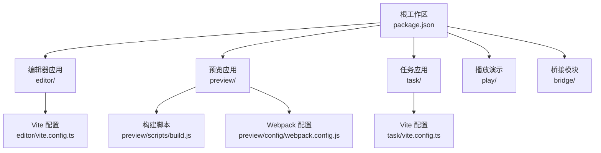
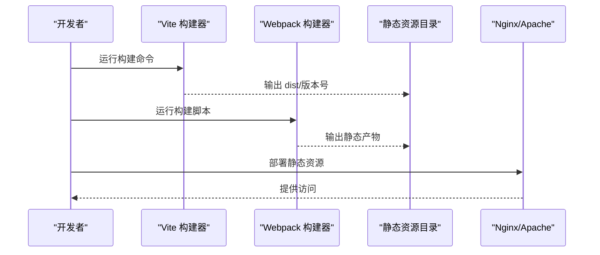
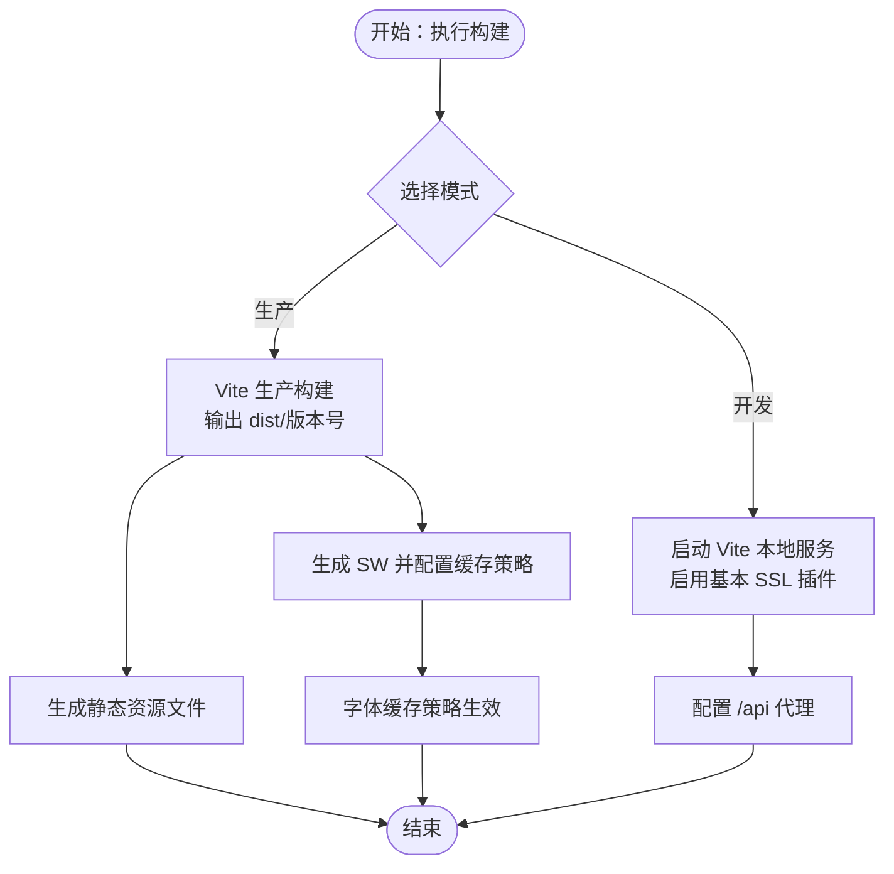
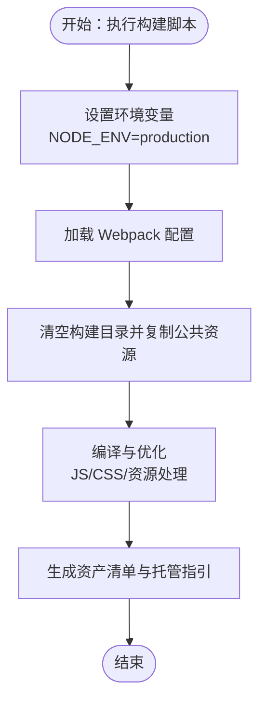
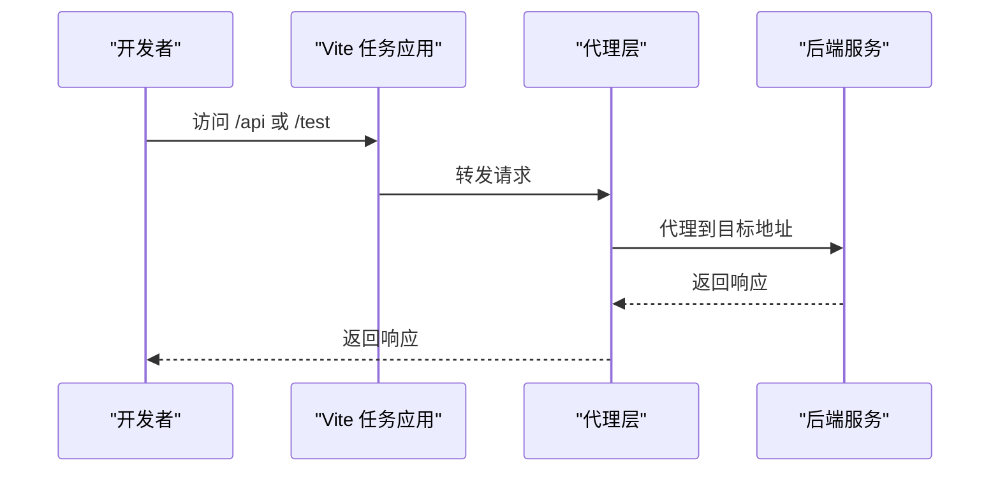
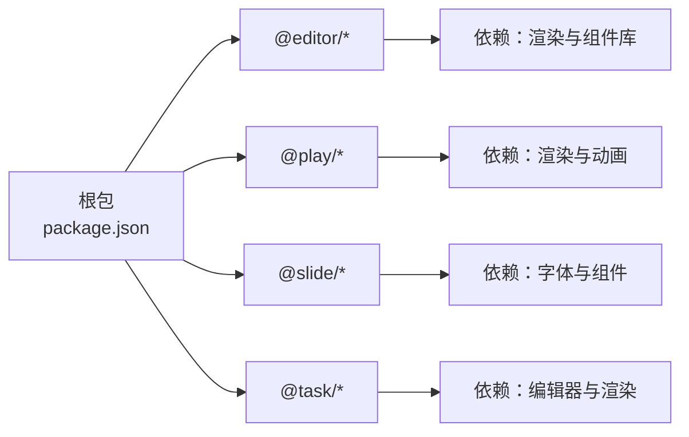

# 传统部署

<cite>
**本文引用的文件**
- [根包配置](file://package.json)
- [通用 Vite 配置](file://vite.config.ts)
- [编辑器应用包配置](file://editor/package.json)
- [编辑器应用 Vite 配置](file://editor/vite.config.ts)
- [预览应用包配置](file://preview/package.json)
- [预览应用构建脚本](file://preview/scripts/build.js)
- [预览应用 Webpack 配置](file://preview/config/webpack.config.js)
- [任务应用包配置](file://task/package.json)
- [任务应用 Vite 配置](file://task/vite.config.ts)
- [任务应用发布配置](file://task/scripts/publish.config.json)
- [编辑器字体复制脚本](file://editor/scripts/fonts.js)
</cite>

## 目录
1. [简介](#简介)
2. [项目结构](#项目结构)
3. [核心组件](#核心组件)
4. [架构总览](#架构总览)
5. [详细组件分析](#详细组件分析)
6. [依赖分析](#依赖分析)
7. [性能考虑](#性能考虑)
8. [故障排查指南](#故障排查指南)
9. [结论](#结论)
10. [附录](#附录)

## 简介
本文件面向 Slides Engine 项目的传统部署场景，聚焦于基于 Vite 的构建与打包流程，覆盖编辑器、预览器、播放器（通过桥接模块）以及任务系统的构建与部署步骤。文档同时说明静态资源的构建过程、文件优化与压缩策略，并给出 Nginx/Apache 的托管配置要点、域名与 HTTPS 设置建议、缓存策略、多环境配置差异，以及部署前检查清单与部署后验证步骤。

## 项目结构
Slides Engine 采用多包工作区组织，核心前端应用分布在 editor、preview、task 等目录中；play 模块用于演示渲染；bridge 下的 cocos-game-player 与 mcc-player 提供游戏/播放相关能力。各应用均提供独立的构建脚本或配置，支持不同模式（开发/测试/生产）的差异化构建。

图表来源
- [根包配置](file://package.json)
- [编辑器应用 Vite 配置](file://editor/vite.config.ts)
- [预览应用构建脚本](file://preview/scripts/build.js)
- [预览应用 Webpack 配置](file://preview/config/webpack.config.js)
- [任务应用 Vite 配置](file://task/vite.config.ts)

章节来源
- [根包配置](file://package.json)
- [通用 Vite 配置](file://vite.config.ts)

## 核心组件
- 编辑器应用：使用 Vite 构建，支持 PWA 缓存、代理 API、本地证书等特性，输出带版本号的 dist 子目录。
- 预览应用：采用自定义 Webpack 流水线，提供生产构建、产物分析与托管指引生成。
- 任务应用：使用 Vite 构建，支持多代理与别名解析，输出带版本号的 dist 子目录。
- 播放器与桥接：通过 bridge 下的模块提供游戏/容器化播放能力，可配合静态部署使用。

章节来源
- [编辑器应用包配置](file://editor/package.json)
- [编辑器应用 Vite 配置](file://editor/vite.config.ts)
- [预览应用包配置](file://preview/package.json)
- [预览应用构建脚本](file://preview/scripts/build.js)
- [预览应用 Webpack 配置](file://preview/config/webpack.config.js)
- [任务应用包配置](file://task/package.json)
- [任务应用 Vite 配置](file://task/vite.config.ts)

## 架构总览
传统部署的核心在于“构建—产物—托管”三段式流程。编辑器与任务应用通过 Vite 产出静态资源；预览应用通过自定义 Webpack 产出静态资源；播放器与桥接模块作为静态资源的一部分参与部署。

图表来源
- [编辑器应用 Vite 配置](file://editor/vite.config.ts)
- [预览应用构建脚本](file://preview/scripts/build.js)
- [预览应用 Webpack 配置](file://preview/config/webpack.config.js)

## 详细组件分析

### 编辑器应用（Editor）
- 构建入口与模式
  - 开发模式：通过 Vite 启动本地服务并启用基本 SSL 插件。
  - 生产模式：使用 Vite 构建，输出至 dist/版本号 目录，支持 PWA 注册与运行时缓存策略。
- 关键配置点
  - 基础路径 base: "./"，适配相对路径部署。
  - 代理配置：将 /api 前缀转发至指定目标地址。
  - PWA：按版本号生成 Service Worker 文件名，配置字体缓存策略。
  - 环境目录：envDir 指向 env 目录，便于多环境变量管理。
- 字体资源处理
  - 构建前执行字体复制脚本，将字体从 @slide/fonts 复制到 public/fonts，确保运行期可用。

图表来源
- [编辑器应用 Vite 配置](file://editor/vite.config.ts)
- [编辑器字体复制脚本](file://editor/scripts/fonts.js)

章节来源
- [编辑器应用包配置](file://editor/package.json)
- [编辑器应用 Vite 配置](file://editor/vite.config.ts)
- [编辑器字体复制脚本](file://editor/scripts/fonts.js)

### 预览应用（Preview）
- 构建流程
  - 使用自定义 Node 脚本驱动 Webpack，生产模式下进行代码压缩、CSS 压缩、资源内联与分包。
  - 产物输出包含 HTML、JS、CSS、媒体资源，并生成资产清单与托管指引。
- 优化与压缩策略
  - JS 压缩：TerserPlugin，按需保留类名与函数名以便调试。
  - CSS 压缩：CssMinimizerPlugin。
  - 资源内联：根据阈值决定是否内联图片等资源。
  - Service Worker：Workbox 注入预缓存清单，限制最大缓存体积。
- 托管与发布
  - 构建脚本会打印部署指引，便于手工或自动化部署到静态服务器。

图表来源
- [预览应用构建脚本](file://preview/scripts/build.js)
- [预览应用 Webpack 配置](file://preview/config/webpack.config.js)

章节来源
- [预览应用包配置](file://preview/package.json)
- [预览应用构建脚本](file://preview/scripts/build.js)
- [预览应用 Webpack 配置](file://preview/config/webpack.config.js)

### 任务应用（Task）
- 构建入口与模式
  - 支持 dev/test/prod 三种模式，生产模式输出 dist/版本号。
  - 本地开发启用基本 SSL 插件，提供代理与别名解析。
- 代理与别名
  - /api 与 /test 两条代理规则，分别指向不同后端服务。
  - @ 别名指向 src 目录，提升导入便捷性。

图表来源
- [任务应用 Vite 配置](file://task/vite.config.ts)

章节来源
- [任务应用包配置](file://task/package.json)
- [任务应用 Vite 配置](file://task/vite.config.ts)
- [任务应用发布配置](file://task/scripts/publish.config.json)

### 播放器与桥接模块（Bridge）
- 模块定位
  - bridge/cocos-game-player 与 bridge/mcc-player 提供游戏/播放相关能力，可作为静态资源的一部分参与部署。
- 部署建议
  - 将其构建产物与主应用静态资源统一托管，确保路径一致与缓存策略协调。

章节来源
- [编辑器应用包配置](file://editor/package.json)
- [任务应用包配置](file://task/package.json)

## 依赖分析
- 工作区与脚本
  - 根包配置声明了多个工作区子包，统一管理依赖与脚本。
  - 通用 Vite 配置提供基础插件与模式支持。
- 应用间依赖
  - 编辑器与任务应用依赖 @play/render、@slide/* 系列包，体现渲染与组件共享。
  - 预览应用依赖 @play/render 与 @slide/render-components 等，强调预览渲染链路。
- 第三方工具
  - 编辑器应用使用 VitePWA、@vitejs/plugin-basic-ssl、@originjs/vite-plugin-commonjs。
  - 预览应用使用 Webpack 生态中的 Terser、MiniCssExtract、Workbox 等插件。
  - 任务应用使用 @vitejs/plugin-basic-ssl 与 react 插件。

图表来源
- [根包配置](file://package.json)
- [编辑器应用包配置](file://editor/package.json)
- [预览应用包配置](file://preview/package.json)
- [任务应用包配置](file://task/package.json)

章节来源
- [根包配置](file://package.json)
- [通用 Vite 配置](file://vite.config.ts)

## 性能考虑
- 代码分割与懒加载
  - 预览应用通过 Webpack 分包与运行时内联策略减少首屏体积。
- 资源压缩
  - JS 使用 Terser 压缩，CSS 使用 CssMinimizer 压缩，HTML 在生产模式下最小化。
- 缓存策略
  - 编辑器应用 PWA 对字体等资源设置长期缓存与过期时间。
  - 预览应用 Workbox 注入预缓存清单，限制最大缓存体积，避免缓存膨胀。
- 资源内联与阈值控制
  - 图片等资源根据阈值决定内联或外链，平衡请求数与缓存命中率。

章节来源
- [预览应用 Webpack 配置](file://preview/config/webpack.config.js)
- [编辑器应用 Vite 配置](file://editor/vite.config.ts)

## 故障排查指南
- 构建失败
  - 检查 Node 版本与依赖安装是否完整，确认各应用的构建脚本与环境变量。
  - 编辑器应用构建前需执行字体复制脚本，确保 public/fonts 存在。
- 代理不生效
  - 确认代理规则与目标地址正确，检查网络连通性与 CORS 设置。
- 静态资源 404
  - 确认 base 路径与服务器路径映射一致，检查 dist/版本号 目录是否存在。
- 缓存问题
  - 更新版本号或清理浏览器缓存，检查 PWA 与 Service Worker 是否正确注册。
- 预览应用构建产物缺失
  - 确认构建脚本已执行且未被 CI 忽略警告导致失败。

章节来源
- [编辑器字体复制脚本](file://editor/scripts/fonts.js)
- [编辑器应用 Vite 配置](file://editor/vite.config.ts)
- [预览应用构建脚本](file://preview/scripts/build.js)
- [任务应用 Vite 配置](file://task/vite.config.ts)

## 结论
Slides Engine 的传统部署以“Vite + Webpack”的混合方式实现：编辑器与任务应用通过 Vite 快速构建并输出静态资源，预览应用通过自定义 Webpack 实现更细粒度的优化与压缩。结合 PWA 与 Workbox 的缓存策略，可在保证性能的同时提升用户体验。部署时应关注基础路径、代理、缓存与版本号管理，确保多环境一致性与稳定性。

## 附录

### 部署前检查清单
- 环境准备
  - 安装 Node.js 与包管理器，确保依赖完整。
  - 准备 Nginx/Apache 服务器与域名解析。
- 构建产物
  - 编辑器：执行字体复制脚本与生产构建，确认 dist/版本号 目录存在。
  - 预览器：执行构建脚本，确认生成的静态资源与托管指引。
  - 任务系统：执行生产构建，确认 dist/版本号 目录存在。
- 代理与证书
  - 校验 /api 与 /test 代理规则，必要时更新为线上目标地址。
  - 如需 HTTPS，确保本地证书或服务器证书配置正确。
- 缓存与版本
  - 确认 PWA 与 Workbox 缓存策略符合预期，版本号更新后缓存失效逻辑正常。

章节来源
- [编辑器应用包配置](file://editor/package.json)
- [编辑器应用 Vite 配置](file://editor/vite.config.ts)
- [预览应用包配置](file://preview/package.json)
- [预览应用构建脚本](file://preview/scripts/build.js)
- [任务应用包配置](file://task/package.json)
- [任务应用 Vite 配置](file://task/vite.config.ts)

### 部署后验证步骤
- 访问首页与关键页面，确认资源加载正常。
- 检查浏览器开发者工具 Network 面板，确认静态资源缓存命中与请求路径正确。
- 验证代理接口返回数据，确认 /api 与 /test 请求转发成功。
- 若启用 PWA，检查 Service Worker 注册状态与缓存内容。
- 对比构建日志与实际产物，确保版本号与发布分支一致。

章节来源
- [编辑器应用 Vite 配置](file://editor/vite.config.ts)
- [预览应用构建脚本](file://preview/scripts/build.js)
- [任务应用 Vite 配置](file://task/vite.config.ts)

### 多环境部署配置示例（概念性说明）
- 开发环境
  - 使用本地代理与基本 SSL，便于联调与本地调试。
- 测试环境
  - 使用测试后端地址与独立域名，开启必要的缓存策略与监控。
- 生产环境
  - 使用 CDN 与长缓存策略，启用 HTTPS 与安全头，定期清理旧版本资源。

[本节为概念性说明，无需文件来源]