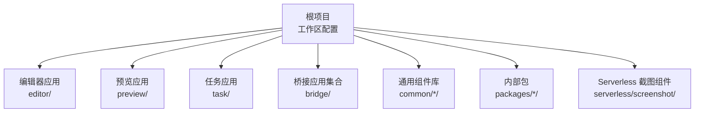
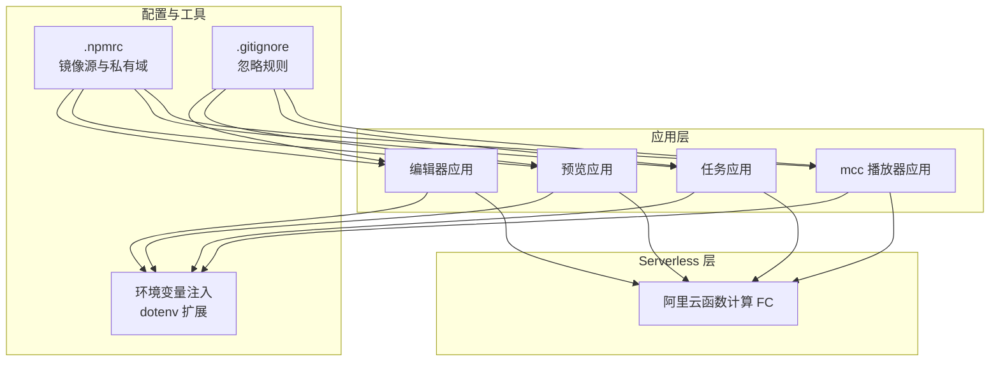

# 环境配置

<cite>
**本文引用的文件**
- [根 package.json](file://package.json)
- [pnpm 工作区配置](file://pnpm-workspace.yaml)
- [.gitignore](file://.gitignore)
- [.npmrc](file://.npmrc)
- [编辑器应用 package.json](file://editor/package.json)
- [预览应用 package.json](file://preview/package.json)
- [任务应用 package.json](file://task/package.json)
- [mcc 播放器应用 package.json](file://bridge/mcc-player/package.json)
- [预览应用环境变量加载逻辑](file://preview/config/env.js)
- [Serverless 截图组件配置](file://serverless/screenshot/s.yaml)
</cite>

## 目录
1. [简介](#简介)
2. [项目结构](#项目结构)
3. [核心组件](#核心组件)
4. [架构总览](#架构总览)
5. [详细组件分析](#详细组件分析)
6. [依赖分析](#依赖分析)
7. [性能考虑](#性能考虑)
8. [故障排查指南](#故障排查指南)
9. [结论](#结论)
10. [附录](#附录)

## 简介
本文件面向 Slides Engine 项目的开发者与运维人员，提供从开发到生产的完整环境配置说明。内容涵盖：
- 开发环境、测试环境与生产环境的差异与要求
- Node.js 版本要求与包管理器（pnpm）配置
- 环境变量设置与注入方式
- 各应用模块（编辑器、预览器、播放器、任务系统）的独立配置要点
- Serverless 服务（阿里云函数计算）的环境准备与配置方法
- 本地开发服务器的启动与调试建议
- 环境变量最佳实践与安全注意事项

## 项目结构
Slides Engine 采用 monorepo 结构，使用 pnpm 工作区统一管理多个子包与应用。根目录通过工作区配置声明各子项目路径，便于统一安装、构建与发布。

图表来源
- [pnpm 工作区配置:1-7](file://pnpm-workspace.yaml#L1-L7)
- [根 package.json:6-15](file://package.json#L6-L15)

章节来源
- [pnpm 工作区配置:1-7](file://pnpm-workspace.yaml#L1-L7)
- [根 package.json:1-58](file://package.json#L1-L58)

## 核心组件
- 包管理与工作区：使用 pnpm 工作区统一管理多包，减少重复依赖，提升安装效率。
- 脚本与模式：各应用通过脚本定义不同运行模式（如 dev/test/prod），配合环境变量实现差异化配置。
- 环境变量：编辑器与任务应用通过 Vite 的模式注入；预览应用通过自定义脚本与 dotenv 扩展加载。
- Serverless：截图组件通过 Serverless Framework 配置阿里云 FC，集中管理运行时、内存、超时与触发器等参数。

章节来源
- [根 package.json:16-23](file://package.json#L16-L23)
- [编辑器应用 package.json:6-16](file://editor/package.json#L6-L16)
- [任务应用 package.json:6-12](file://task/package.json#L6-L12)
- [预览应用环境变量加载逻辑:18-41](file://preview/config/env.js#L18-L41)
- [Serverless 截图组件配置:1-60](file://serverless/screenshot/s.yaml#L1-L60)

## 架构总览
下图展示各应用与 Serverless 组件在环境配置层面的交互关系，以及环境变量与构建模式对运行行为的影响。

图表来源
- [.npmrc:1-3](file://.npmrc#L1-L3)
- [.gitignore:1-40](file://.gitignore#L1-L40)
- [预览应用环境变量加载逻辑:18-41](file://preview/config/env.js#L18-L41)
- [编辑器应用 package.json:6-16](file://editor/package.json#L6-L16)
- [任务应用 package.json:6-12](file://task/package.json#L6-L12)
- [mcc 播放器应用 package.json:5-20](file://bridge/mcc-player/package.json#L5-L20)
- [Serverless 截图组件配置:1-60](file://serverless/screenshot/s.yaml#L1-L60)

## 详细组件分析

### Node.js 与包管理器
- Node.js 版本要求
  - 根项目未显式声明 engines 字段，但部分子包对 Node 版本有要求。例如播放器应用声明了最低版本要求，建议在本地与 CI 中统一 Node 版本以避免兼容性问题。
- 包管理器
  - 使用 pnpm 作为包管理器，并通过工作区配置统一管理多包。
  - 通过 .npmrc 配置镜像源与私有域，加速安装并确保依赖解析正确。

章节来源
- [mcc 播放器应用 package.json:28-30](file://bridge/mcc-player/package.json#L28-L30)
- [pnpm 工作区配置:1-7](file://pnpm-workspace.yaml#L1-L7)
- [.npmrc:1-3](file://.npmrc#L1-L3)

### 环境变量与注入机制
- 编辑器与任务应用
  - 通过 Vite 的 --mode 参数注入不同模式的变量，结合各自的脚本实现 dev/test/prod 差异化。
- 预览应用
  - 通过自定义脚本加载 dotenv 文件，支持按环境加载 .env.local、.env.{NODE_ENV}、.env 等文件，并通过 DefinePlugin 注入到应用中。
- Serverless
  - 在 s.yaml 中集中配置环境变量（如 COS_SECRET_KEY、COS_SECRET_ID、COS_BUCKET、HOST 等），部署后由阿里云函数计算实例读取。

章节来源
- [编辑器应用 package.json:6-16](file://editor/package.json#L6-L16)
- [任务应用 package.json:6-12](file://task/package.json#L6-L12)
- [预览应用环境变量加载逻辑:18-41](file://preview/config/env.js#L18-L41)
- [Serverless 截图组件配置:33-40](file://serverless/screenshot/s.yaml#L33-L40)

### 应用模块独立配置

#### 编辑器应用（editor）
- 运行模式
  - 提供 dev、build、build:prod、release:test 等脚本，分别对应开发、测试构建、生产构建与热更新流程。
- 依赖与插件
  - 使用 @vitejs/plugin-react 与 TypeScript 支持，集成 PWA 插件与 Sentry 错误监控。
- 资源处理
  - 提供字体复制脚本，确保字体资源在开发阶段可用。

章节来源
- [编辑器应用 package.json:6-16](file://editor/package.json#L6-L16)
- [编辑器应用 package.json:17-64](file://editor/package.json#L17-L64)

#### 预览应用（preview）
- 构建与发布
  - 提供 start、build、build:prod、upload、release 等脚本，支持打包、上传与产物移动。
- 测试与 Jest
  - 内置 Jest 配置与 Babel 转换规则，支持 DOM 环境与模块映射。
- 环境变量
  - 通过自定义脚本加载 dotenv 并注入到应用中，支持多环境文件叠加。

章节来源
- [预览应用 package.json:76-88](file://preview/package.json#L76-L88)
- [预览应用 package.json:108-167](file://preview/package.json#L108-L167)
- [预览应用环境变量加载逻辑:18-41](file://preview/config/env.js#L18-L41)

#### 任务应用（task）
- 运行模式
  - 提供 dev、build:test、build:prod、hotUpdate:test、release:test 等脚本，支持国际化与路由配置。
- 依赖与插件
  - 使用 Vite 5、React 18 与 TypeScript，集成 antd、i18n、Redux 等生态。

章节来源
- [任务应用 package.json:6-12](file://task/package.json#L6-L12)
- [任务应用 package.json:13-57](file://task/package.json#L13-L57)

#### 播放器应用（bridge/mcc-player）
- 运行模式
  - 提供 dev、dev:prod、build、build:test、build:prod、release 等脚本，支持 Rollup 构建与热更新。
- 依赖与插件
  - 使用 Vite、Rollup 与 Babel，集成 axios、events、whatwg-fetch 等运行时依赖。
- Node 版本
  - 显式声明 Node >= 10.0.0，建议在更高版本上进行开发以获得更好的稳定性与性能。

章节来源
- [mcc 播放器应用 package.json:5-20](file://bridge/mcc-player/package.json#L5-L20)
- [mcc 播放器应用 package.json:21-72](file://bridge/mcc-player/package.json#L21-L72)

### Serverless 服务（阿里云函数计算）
- 组件与服务
  - 使用 Serverless Framework 的 fc 组件，配置区域、服务、函数、触发器与环境变量。
- 运行时与资源
  - 指定 Node.js 16 运行时、CPU 与内存大小、超时时间与并发数，启用 Puppeteer 层以支持截图。
- 环境变量
  - 配置 COS 访问密钥、存储桶、区域与 API 主机地址等，确保函数执行时具备访问外部资源的能力。

章节来源
- [Serverless 截图组件配置:1-60](file://serverless/screenshot/s.yaml#L1-L60)

## 依赖分析
- 工作区与依赖
  - 根 package.json 声明工作区范围，统一管理 packages/*、slides/*、play、render-core、preview、slide-shape、slide-editor、animate 等模块。
- 依赖解析与镜像
  - .npmrc 配置了官方镜像源与私有域，确保依赖下载稳定与可复现。
- 忽略规则
  - .gitignore 定义了常见日志、构建产物与 IDE 相关文件的忽略策略，减少仓库体积与误提交风险。

章节来源
- [根 package.json:6-15](file://package.json#L6-L15)
- [.npmrc:1-3](file://.npmrc#L1-L3)
- [.gitignore:1-40](file://.gitignore#L1-L40)

## 性能考虑
- 使用 pnpm 工作区减少磁盘占用与安装时间，提升整体开发体验。
- 预览应用通过多环境 dotenv 文件分层加载，避免在单个文件中堆积大量配置，便于维护与定位问题。
- Serverless 函数配置了合理的 CPU、内存与超时时间，结合 Puppeteer 层以平衡性能与成本。

## 故障排查指南
- 环境变量未生效
  - 检查是否正确设置 NODE_ENV 与对应的 .env.{NODE_ENV} 文件是否存在。
  - 确认 dotenv 扩展已正确加载并注入到应用中。
- 构建失败或产物异常
  - 确认脚本使用的模式与目标环境一致（dev/test/prod）。
  - 检查各应用的构建脚本与插件配置，确保 TypeScript、Babel 或 Rollup 插件版本兼容。
- Serverless 部署失败
  - 核对 s.yaml 中的 region、service、function、environmentVariables 等字段是否正确。
  - 确认阿里云 RAM 角色与权限策略允许函数访问 COS 与日志服务。
- Node 版本不匹配
  - 播放器应用明确要求 Node >= 10.0.0，建议在本地与 CI 中统一 Node 版本，避免二进制依赖或运行时差异导致的问题。

章节来源
- [预览应用环境变量加载逻辑:10-15](file://preview/config/env.js#L10-L15)
- [预览应用环境变量加载逻辑:33-41](file://preview/config/env.js#L33-L41)
- [mcc 播放器应用 package.json:28-30](file://bridge/mcc-player/package.json#L28-L30)
- [Serverless 截图组件配置:8-32](file://serverless/screenshot/s.yaml#L8-L32)

## 结论
本文件提供了 Slides Engine 项目在多环境下的配置要点与最佳实践。通过 pnpm 工作区统一管理、清晰的环境变量注入机制与 Serverless 组件化部署，项目能够在开发、测试与生产环境中保持一致性与可维护性。建议团队在 CI/CD 中固化 Node 版本与依赖版本，并持续完善环境变量的安全策略与审计记录。

## 附录

### 环境变量最佳实践与安全考虑
- 最小暴露原则
  - 仅在必要范围内暴露敏感变量，避免在代码中硬编码密钥与令牌。
- 分层管理
  - 将通用变量放入 .env，按环境放入 .env.{NODE_ENV}，按主机放入 .env.local，最后通过 dotenv 扩展合并。
- 变量命名规范
  - 使用 REACT_APP_ 前缀注入前端应用（Vite 模式下），或在 Serverless 中直接配置环境变量键值。
- 审计与轮换
  - 对密钥类变量定期轮换，保留历史版本以便回滚与审计。
- CI/CD 安全
  - 在 CI 中使用受保护变量与加密存储，避免明文泄露。

章节来源
- [预览应用环境变量加载逻辑:61-102](file://preview/config/env.js#L61-L102)
- [Serverless 截图组件配置:33-40](file://serverless/screenshot/s.yaml#L33-L40)