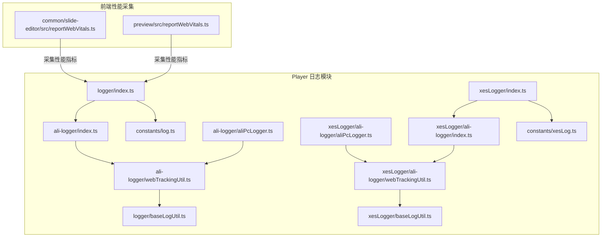
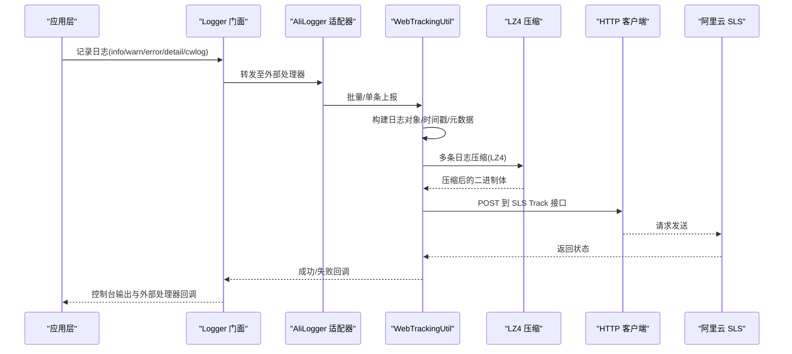
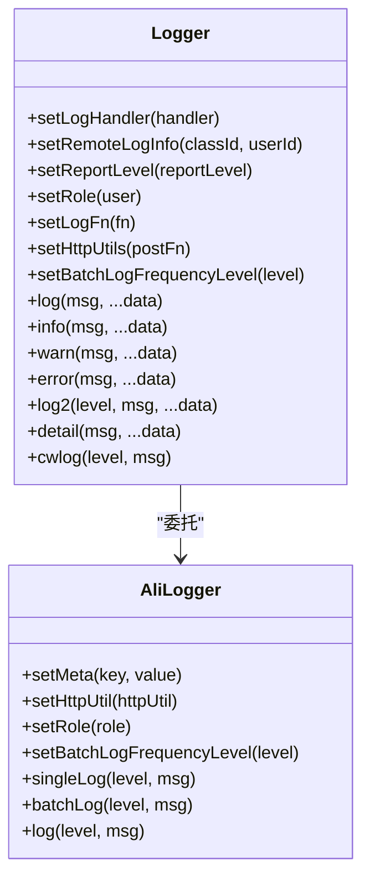
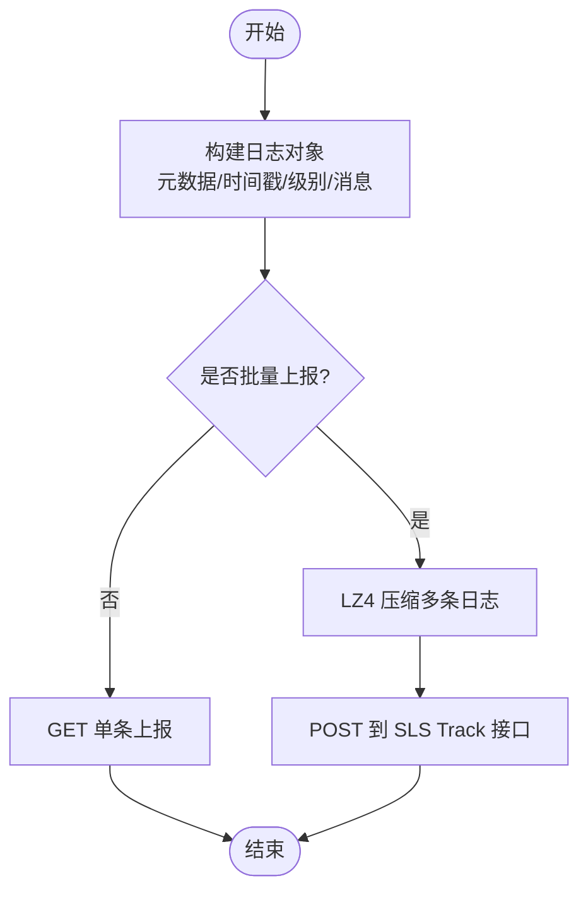
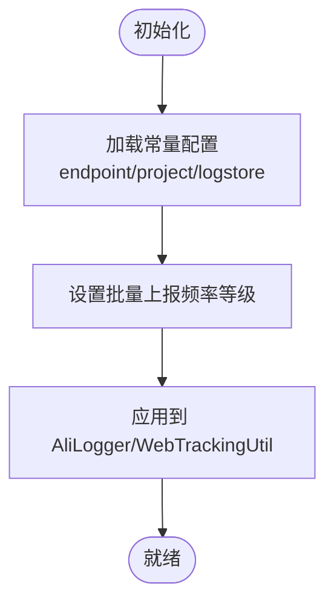
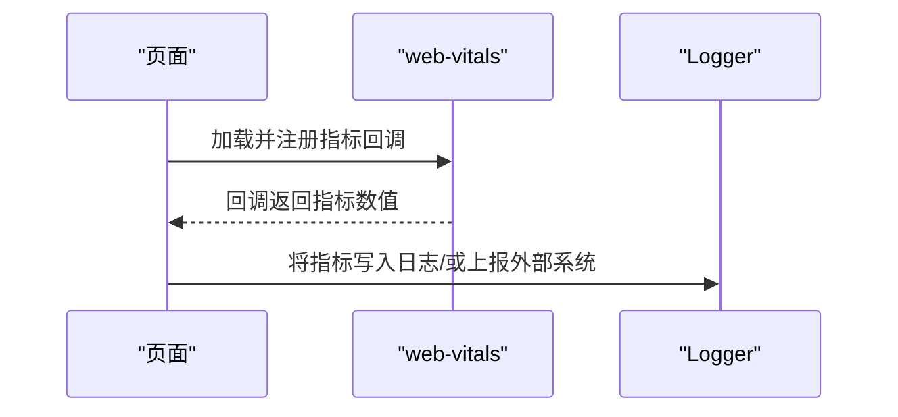
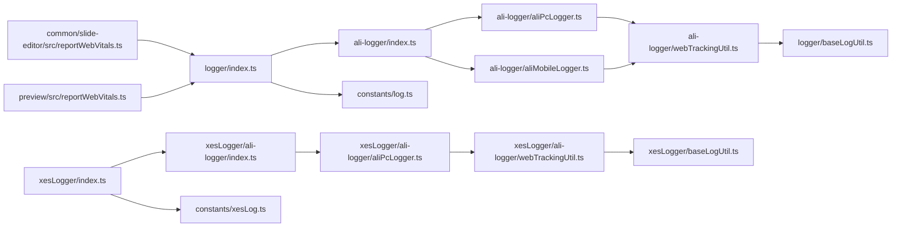

# 监控与日志

<cite>
**本文引用的文件**
- [logger/index.ts](file://bridge/mcc-player/src/libs/logger/index.ts)
- [xesLogger/index.ts](file://bridge/mcc-player/src/libs/xesLogger/index.ts)
- [ali-logger/index.ts](file://bridge/mcc-player/src/libs/logger/ali-logger/index.ts)
- [xesLogger/ali-logger/index.ts](file://bridge/mcc-player/src/libs/xesLogger/ali-logger/index.ts)
- [ali-logger/webTrackingUtil.ts](file://bridge/mcc-player/src/libs/logger/ali-logger/webTrackingUtil.ts)
- [xesLogger/ali-logger/webTrackingUtil.ts](file://bridge/mcc-player/src/libs/xesLogger/ali-logger/webTrackingUtil.ts)
- [ali-logger/aliPcLogger.ts](file://bridge/mcc-player/src/libs/logger/ali-logger/aliPcLogger.ts)
- [xesLogger/ali-logger/aliPcLogger.ts](file://bridge/mcc-player/src/libs/xesLogger/ali-logger/aliPcLogger.ts)
- [baseLogUtil.ts](file://bridge/mcc-player/src/libs/logger/baseLogUtil.ts)
- [xesLogger/baseLogUtil.ts](file://bridge/mcc-player/src/libs/xesLogger/baseLogUtil.ts)
- [log.ts](file://bridge/mcc-player/src/constants/log.ts)
- [xesLog.ts](file://bridge/mcc-player/src/constants/xesLog.ts)
- [reportWebVitals.ts](file://common/slide-editor/src/reportWebVitals.ts)
- [reportWebVitals.ts](file://preview/src/reportWebVitals.ts)
- [pnpm-lock.yaml](file://pnpm-lock.yaml)
</cite>

## 目录
1. [简介](#简介)
2. [项目结构](#项目结构)
3. [核心组件](#核心组件)
4. [架构总览](#架构总览)
5. [详细组件分析](#详细组件分析)
6. [依赖关系分析](#依赖关系分析)
7. [性能考量](#性能考量)
8. [故障排查指南](#故障排查指南)
9. [结论](#结论)
10. [附录](#附录)

## 简介
本文件面向 Slides Engine 项目的监控与日志系统部署，目标如下：
- 明确应用监控指标的配置与采集：性能指标（前端 web-vitals）、业务指标（播放/加载事件）、错误率监控（浏览器端错误与日志上报失败统计）。
- 规范日志系统部署与配置：结构化日志格式、日志级别、批量上报策略与压缩传输。
- 提供 ELK Stack 或类似技术栈的集成思路与落地方案。
- 说明告警规则与通知渠道配置建议。
- 介绍 APM 工具（如 Sentry）在浏览器端的集成方法。
- 提供分布式链路追踪的可选实现路径与关键指标可视化建议。

## 项目结构
Slides Engine 由多包与多页面构成，监控与日志相关能力主要集中在 Player 侧的 logger 与 xesLogger 模块中，同时前端页面通过 web-vitals 进行性能指标采集。

图表来源
- [logger/index.ts:1-191](file://bridge/mcc-player/src/libs/logger/index.ts#L1-191)
- [xesLogger/index.ts:1-191](file://bridge/mcc-player/src/libs/xesLogger/index.ts#L1-191)
- [ali-logger/index.ts:1-63](file://bridge/mcc-player/src/libs/logger/ali-logger/index.ts#L1-63)
- [xesLogger/ali-logger/index.ts:1-63](file://bridge/mcc-player/src/libs/xesLogger/ali-logger/index.ts#L1-63)
- [ali-logger/webTrackingUtil.ts:42-201](file://bridge/mcc-player/src/libs/logger/ali-logger/webTrackingUtil.ts#L42-201)
- [xesLogger/ali-logger/webTrackingUtil.ts:42-201](file://bridge/mcc-player/src/libs/xesLogger/ali-logger/webTrackingUtil.ts#L42-201)
- [ali-logger/aliPcLogger.ts:1-12](file://bridge/mcc-player/src/libs/logger/ali-logger/aliPcLogger.ts#L1-12)
- [xesLogger/ali-logger/aliPcLogger.ts:1-12](file://bridge/mcc-player/src/libs/xesLogger/ali-logger/aliPcLogger.ts#L1-12)
- [logger/baseLogUtil.ts:1-55](file://bridge/mcc-player/src/libs/logger/baseLogUtil.ts#L1-55)
- [xesLogger/baseLogUtil.ts:1-55](file://bridge/mcc-player/src/libs/xesLogger/baseLogUtil.ts#L1-55)
- [constants/log.ts:1-48](file://bridge/mcc-player/src/constants/log.ts#L1-48)
- [constants/xesLog.ts:1-50](file://bridge/mcc-player/src/constants/xesLog.ts#L1-50)
- [reportWebVitals.ts:1-15](file://common/slide-editor/src/reportWebVitals.ts#L1-15)
- [reportWebVitals.ts:1-15](file://preview/src/reportWebVitals.ts#L1-15)

章节来源
- [logger/index.ts:1-191](file://bridge/mcc-player/src/libs/logger/index.ts#L1-191)
- [xesLogger/index.ts:1-191](file://bridge/mcc-player/src/libs/xesLogger/index.ts#L1-191)
- [ali-logger/index.ts:1-63](file://bridge/mcc-player/src/libs/logger/ali-logger/index.ts#L1-63)
- [xesLogger/ali-logger/index.ts:1-63](file://bridge/mcc-player/src/libs/xesLogger/ali-logger/index.ts#L1-63)
- [ali-logger/webTrackingUtil.ts:42-201](file://bridge/mcc-player/src/libs/logger/ali-logger/webTrackingUtil.ts#L42-201)
- [xesLogger/ali-logger/webTrackingUtil.ts:42-201](file://bridge/mcc-player/src/libs/xesLogger/ali-logger/webTrackingUtil.ts#L42-201)
- [ali-logger/aliPcLogger.ts:1-12](file://bridge/mcc-player/src/libs/logger/ali-logger/aliPcLogger.ts#L1-12)
- [xesLogger/ali-logger/aliPcLogger.ts:1-12](file://bridge/mcc-player/src/libs/xesLogger/ali-logger/aliPcLogger.ts#L1-12)
- [logger/baseLogUtil.ts:1-55](file://bridge/mcc-player/src/libs/logger/baseLogUtil.ts#L1-55)
- [xesLogger/baseLogUtil.ts:1-55](file://bridge/mcc-player/src/libs/xesLogger/baseLogUtil.ts#L1-55)
- [constants/log.ts:1-48](file://bridge/mcc-player/src/constants/log.ts#L1-48)
- [constants/xesLog.ts:1-50](file://bridge/mcc-player/src/constants/xesLog.ts#L1-50)
- [reportWebVitals.ts:1-15](file://common/slide-editor/src/reportWebVitals.ts#L1-15)
- [reportWebVitals.ts:1-15](file://preview/src/reportWebVitals.ts#L1-15)

## 核心组件
- 统一日志门面：提供 info/warn/error/detail/cwlog 等接口，统一外部 handler 与控制台输出；支持设置角色、远程日志信息、HTTP 工具与批量上报频率。
- 阿里云日志适配器：根据运行环境选择 PC 或移动端实现，封装批量上报、压缩与队列处理。
- WebTrackingUtil：负责构建日志对象、时间戳、元数据、批量上传、LZ4 压缩与错误处理。
- 常量配置：定义阿里 SLS 的 endpoint/project/logstore 以及批量上报频率等级与阈值。
- 性能指标采集：通过 web-vitals 在编辑器与预览页采集 CLS/FID/FCP/LCP/TTFB。

章节来源
- [logger/index.ts:106-190](file://bridge/mcc-player/src/libs/logger/index.ts#L106-190)
- [xesLogger/index.ts:106-190](file://bridge/mcc-player/src/libs/xesLogger/index.ts#L106-190)
- [ali-logger/index.ts:8-62](file://bridge/mcc-player/src/libs/logger/ali-logger/index.ts#L8-62)
- [xesLogger/ali-logger/index.ts:8-62](file://bridge/mcc-player/src/libs/xesLogger/ali-logger/index.ts#L8-62)
- [ali-logger/webTrackingUtil.ts:42-201](file://bridge/mcc-player/src/libs/logger/ali-logger/webTrackingUtil.ts#L42-201)
- [xesLogger/ali-logger/webTrackingUtil.ts:42-201](file://bridge/mcc-player/src/libs/xesLogger/ali-logger/webTrackingUtil.ts#L42-201)
- [constants/log.ts:10-48](file://bridge/mcc-player/src/constants/log.ts#L10-48)
- [constants/xesLog.ts:12-50](file://bridge/mcc-player/src/constants/xesLog.ts#L12-50)
- [reportWebVitals.ts:1-15](file://common/slide-editor/src/reportWebVitals.ts#L1-15)
- [reportWebVitals.ts:1-15](file://preview/src/reportWebVitals.ts#L1-15)

## 架构总览
下图展示了浏览器端日志从应用到阿里云 SLS 的完整链路，以及性能指标采集与上报流程。

图表来源
- [logger/index.ts:40-48](file://bridge/mcc-player/src/libs/logger/index.ts#L40-48)
- [ali-logger/index.ts:8-62](file://bridge/mcc-player/src/libs/logger/ali-logger/index.ts#L8-62)
- [ali-logger/webTrackingUtil.ts:72-112](file://bridge/mcc-player/src/libs/logger/ali-logger/webTrackingUtil.ts#L72-112)
- [logger/baseLogUtil.ts:37-48](file://bridge/mcc-player/src/libs/logger/baseLogUtil.ts#L37-48)

## 详细组件分析

### 组件一：Logger 门面与 AliLogger 适配器
- Logger 门面职责
  - 统一日志接口：info/warn/error/detail/cwlog。
  - 外部处理器管理：支持添加自定义 handler 并按级别过滤。
  - 元数据注入：设置源信息（如班级/用户 ID）。
  - 批量上报频率控制：通过 setBatchLogFrequencyLevel 设置上报节奏。
  - HTTP 工具注入：允许替换底层网络请求实现。
- AliLogger 适配器职责
  - 根据运行环境选择 PC 或移动端实现。
  - 统一封装 setMeta/setHttpUtil/setRole/setBatchLogFrequencyLevel/log/batchLog/singleLog。

图表来源
- [logger/index.ts:23-185](file://bridge/mcc-player/src/libs/logger/index.ts#L23-185)
- [ali-logger/index.ts:8-62](file://bridge/mcc-player/src/libs/logger/ali-logger/index.ts#L8-62)

章节来源
- [logger/index.ts:106-190](file://bridge/mcc-player/src/libs/logger/index.ts#L106-190)
- [ali-logger/index.ts:8-62](file://bridge/mcc-player/src/libs/logger/ali-logger/index.ts#L8-62)

### 组件二：WebTrackingUtil 与 LZ4 批量上报
- 日志对象构建：包含元数据、序列号、时间戳、级别与消息。
- 单条/批量上报：单条通过 GET 参数拼接，批量通过 POST 二进制体并设置压缩头。
- LZ4 压缩：对多条日志进行压缩，减少带宽与延迟。
- 错误处理：捕获网络异常并记录失败任务，便于后续重试或降级。

图表来源
- [ali-logger/webTrackingUtil.ts:49-112](file://bridge/mcc-player/src/libs/logger/ali-logger/webTrackingUtil.ts#L49-112)
- [logger/baseLogUtil.ts:37-48](file://bridge/mcc-player/src/libs/logger/baseLogUtil.ts#L37-48)

章节来源
- [ali-logger/webTrackingUtil.ts:42-201](file://bridge/mcc-player/src/libs/logger/ali-logger/webTrackingUtil.ts#L42-201)
- [logger/baseLogUtil.ts:1-55](file://bridge/mcc-player/src/libs/logger/baseLogUtil.ts#L1-55)

### 组件三：常量配置与批量频率
- 阿里 SLS 基础信息：endpoint、project、logstore。
- 批量上报频率等级：HIGH/MEDIUM/LOW，分别对应时间间隔与单次上限。
- 业务线常量：提供两套配置（log.ts 与 xesLog.ts），用于区分不同业务场景。

图表来源
- [constants/log.ts:10-48](file://bridge/mcc-player/src/constants/log.ts#L10-48)
- [constants/xesLog.ts:12-50](file://bridge/mcc-player/src/constants/xesLog.ts#L12-50)
- [ali-logger/index.ts:42-46](file://bridge/mcc-player/src/libs/logger/ali-logger/index.ts#L42-46)

章节来源
- [constants/log.ts:1-48](file://bridge/mcc-player/src/constants/log.ts#L1-48)
- [constants/xesLog.ts:1-50](file://bridge/mcc-player/src/constants/xesLog.ts#L1-50)
- [ali-logger/index.ts:42-46](file://bridge/mcc-player/src/libs/logger/ali-logger/index.ts#L42-46)

### 组件四：性能指标采集（web-vitals）
- 在编辑器与预览页引入 web-vitals，采集 CLS/FID/FCP/LCP/TTFB。
- 可将采集结果作为业务指标上报至日志系统或外部监控平台。

图表来源
- [reportWebVitals.ts:1-15](file://common/slide-editor/src/reportWebVitals.ts#L1-15)
- [reportWebVitals.ts:1-15](file://preview/src/reportWebVitals.ts#L1-15)

章节来源
- [reportWebVitals.ts:1-15](file://common/slide-editor/src/reportWebVitals.ts#L1-15)
- [reportWebVitals.ts:1-15](file://preview/src/reportWebVitals.ts#L1-15)

## 依赖关系分析
- Logger 门面依赖 AliLogger；AliLogger 根据运行环境选择 AliPcLogger 或 AliMobileLogger。
- AliPcLogger/aliPcLogger 继承自 WebTrackingUtil，后者负责日志对象构建与批量上报。
- 常量配置文件提供 endpoint/project/logstore 与批量频率等级。
- 前端性能采集通过 web-vitals 注入到页面生命周期中。

图表来源
- [logger/index.ts:1-191](file://bridge/mcc-player/src/libs/logger/index.ts#L1-191)
- [ali-logger/index.ts:1-63](file://bridge/mcc-player/src/libs/logger/ali-logger/index.ts#L1-63)
- [ali-logger/aliPcLogger.ts:1-12](file://bridge/mcc-player/src/libs/logger/ali-logger/aliPcLogger.ts#L1-12)
- [ali-logger/webTrackingUtil.ts:42-201](file://bridge/mcc-player/src/libs/logger/ali-logger/webTrackingUtil.ts#L42-201)
- [logger/baseLogUtil.ts:1-55](file://bridge/mcc-player/src/libs/logger/baseLogUtil.ts#L1-55)
- [constants/log.ts:1-48](file://bridge/mcc-player/src/constants/log.ts#L1-48)
- [xesLogger/index.ts:1-191](file://bridge/mcc-player/src/libs/xesLogger/index.ts#L1-191)
- [xesLogger/ali-logger/index.ts:1-63](file://bridge/mcc-player/src/libs/xesLogger/ali-logger/index.ts#L1-63)
- [xesLogger/ali-logger/aliPcLogger.ts:1-12](file://bridge/mcc-player/src/libs/xesLogger/ali-logger/aliPcLogger.ts#L1-12)
- [xesLogger/ali-logger/webTrackingUtil.ts:42-201](file://bridge/mcc-player/src/libs/xesLogger/ali-logger/webTrackingUtil.ts#L42-201)
- [xesLogger/baseLogUtil.ts:1-55](file://bridge/mcc-player/src/libs/xesLogger/baseLogUtil.ts#L1-55)
- [constants/xesLog.ts:1-50](file://bridge/mcc-player/src/constants/xesLog.ts#L1-50)
- [reportWebVitals.ts:1-15](file://common/slide-editor/src/reportWebVitals.ts#L1-15)
- [reportWebVitals.ts:1-15](file://preview/src/reportWebVitals.ts#L1-15)

章节来源
- [logger/index.ts:1-191](file://bridge/mcc-player/src/libs/logger/index.ts#L1-191)
- [ali-logger/index.ts:1-63](file://bridge/mcc-player/src/libs/logger/ali-logger/index.ts#L1-63)
- [ali-logger/aliPcLogger.ts:1-12](file://bridge/mcc-player/src/libs/logger/ali-logger/aliPcLogger.ts#L1-12)
- [ali-logger/webTrackingUtil.ts:42-201](file://bridge/mcc-player/src/libs/logger/ali-logger/webTrackingUtil.ts#L42-201)
- [logger/baseLogUtil.ts:1-55](file://bridge/mcc-player/src/libs/logger/baseLogUtil.ts#L1-55)
- [constants/log.ts:1-48](file://bridge/mcc-player/src/constants/log.ts#L1-48)
- [xesLogger/index.ts:1-191](file://bridge/mcc-player/src/libs/xesLogger/index.ts#L1-191)
- [xesLogger/ali-logger/index.ts:1-63](file://bridge/mcc-player/src/libs/xesLogger/ali-logger/index.ts#L1-63)
- [xesLogger/ali-logger/aliPcLogger.ts:1-12](file://bridge/mcc-player/src/libs/xesLogger/ali-logger/aliPcLogger.ts#L1-12)
- [xesLogger/ali-logger/webTrackingUtil.ts:42-201](file://bridge/mcc-player/src/libs/xesLogger/ali-logger/webTrackingUtil.ts#L42-201)
- [xesLogger/baseLogUtil.ts:1-55](file://bridge/mcc-player/src/libs/xesLogger/baseLogUtil.ts#L1-55)
- [constants/xesLog.ts:1-50](file://bridge/mcc-player/src/constants/xesLog.ts#L1-50)
- [reportWebVitals.ts:1-15](file://common/slide-editor/src/reportWebVitals.ts#L1-15)
- [reportWebVitals.ts:1-15](file://preview/src/reportWebVitals.ts#L1-15)

## 性能考量
- 批量上报与压缩：通过 LZ4 对多条日志进行压缩，降低带宽与请求次数，提升吞吐。
- 上报频率控制：根据业务负载选择 HIGH/MEDIUM/LOW 等级，避免高峰期拥塞。
- 单条回退：当批量失败时，自动切换单条上报以保证可用性。
- 前端性能指标：web-vitals 仅在需要时按需加载，避免对首屏性能造成额外影响。

章节来源
- [ali-logger/webTrackingUtil.ts:60-112](file://bridge/mcc-player/src/libs/logger/ali-logger/webTrackingUtil.ts#L60-112)
- [constants/log.ts:16-48](file://bridge/mcc-player/src/constants/log.ts#L16-48)
- [reportWebVitals.ts:1-15](file://common/slide-editor/src/reportWebVitals.ts#L1-15)

## 故障排查指南
- 日志上报失败
  - 现象：控制台打印失败信息，批量任务标记失败。
  - 排查：检查 endpoint/project/logstore 是否正确；确认网络可达；查看压缩头与 Content-Type 设置。
- 批量频率过高导致丢日志
  - 现象：短时间内大量日志被丢弃或延迟。
  - 排查：调整批量频率等级；检查 putMaxCount 与 PUTTIMESPAN 配置。
- 结构化日志缺失字段
  - 现象：SLS 查询不到关键字段。
  - 排查：确认 baseLogUtil 中元数据与时间戳生成逻辑；确保 setMeta 正确注入。

章节来源
- [ali-logger/webTrackingUtil.ts:108-111](file://bridge/mcc-player/src/libs/logger/ali-logger/webTrackingUtil.ts#L108-111)
- [logger/baseLogUtil.ts:37-48](file://bridge/mcc-player/src/libs/logger/baseLogUtil.ts#L37-48)
- [constants/log.ts:16-48](file://bridge/mcc-player/src/constants/log.ts#L16-48)

## 结论
Slides Engine 的监控与日志体系以 Logger 门面为核心，结合 AliLogger 适配器与 WebTrackingUtil 实现了结构化、可配置、可压缩的批量上报能力，并通过 web-vitals 提供前端性能指标采集。配合合理的批量频率与错误处理机制，可在保证用户体验的同时满足可观测性需求。后续可在此基础上接入 ELK 或 APM 平台，完善告警与可视化。

## 附录

### APM 工具（如 Sentry）集成建议
- 浏览器端集成
  - 引入 @sentry/browser，初始化 DSN 与基本选项。
  - 启用 tracing 与 replay（如需）。
  - 将关键业务日志与错误事件上报至 Sentry。
- 与现有日志体系协同
  - 将 Sentry 的错误事件映射到现有 Logger.cwlog，统一归档与检索。
  - 通过外部处理器将 Sentry 事件转发至阿里 SLS，实现双通道备份。

章节来源
- [pnpm-lock.yaml:6726-6736](file://pnpm-lock.yaml#L6726-L6736)