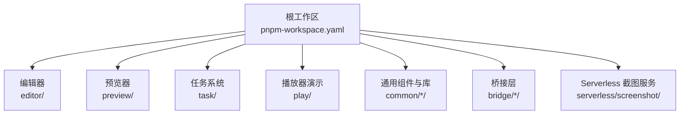
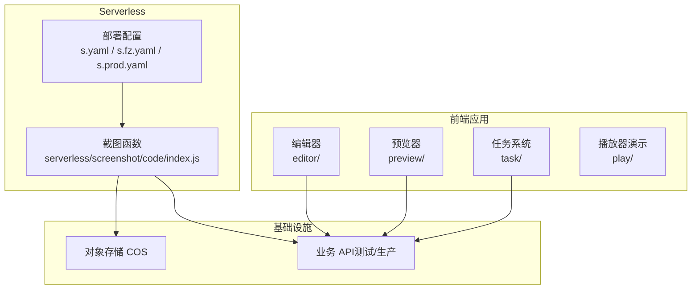
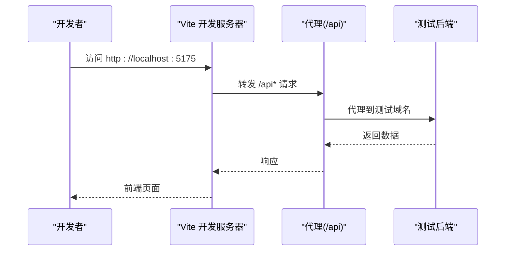
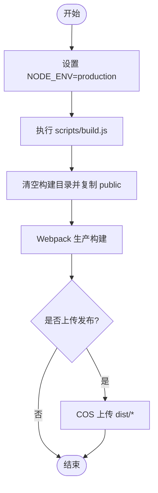
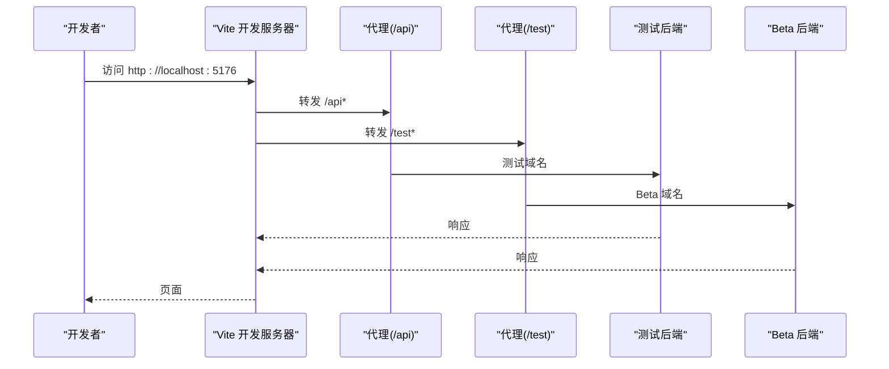
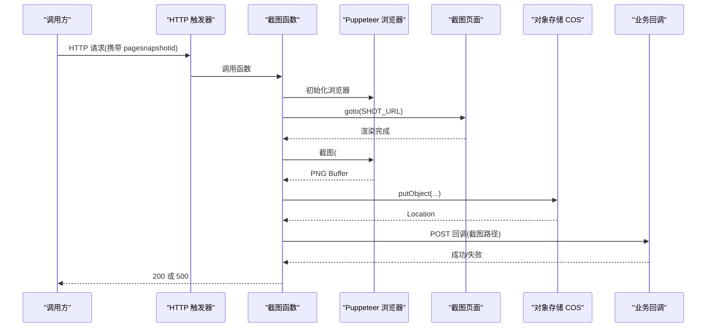
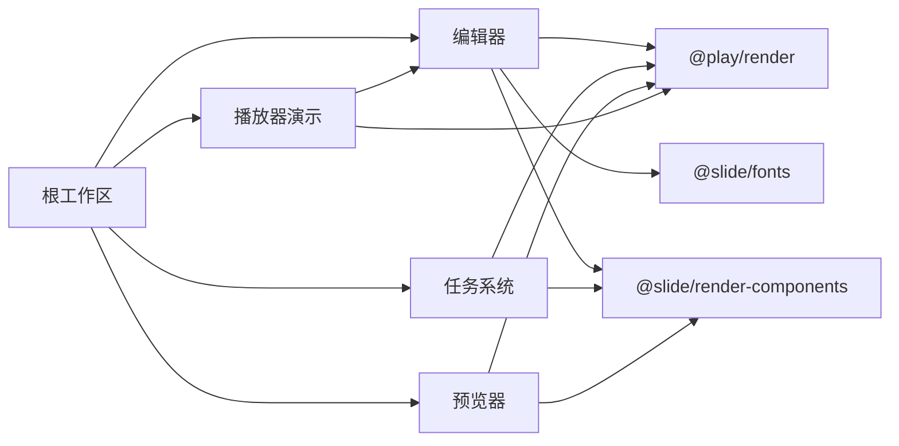
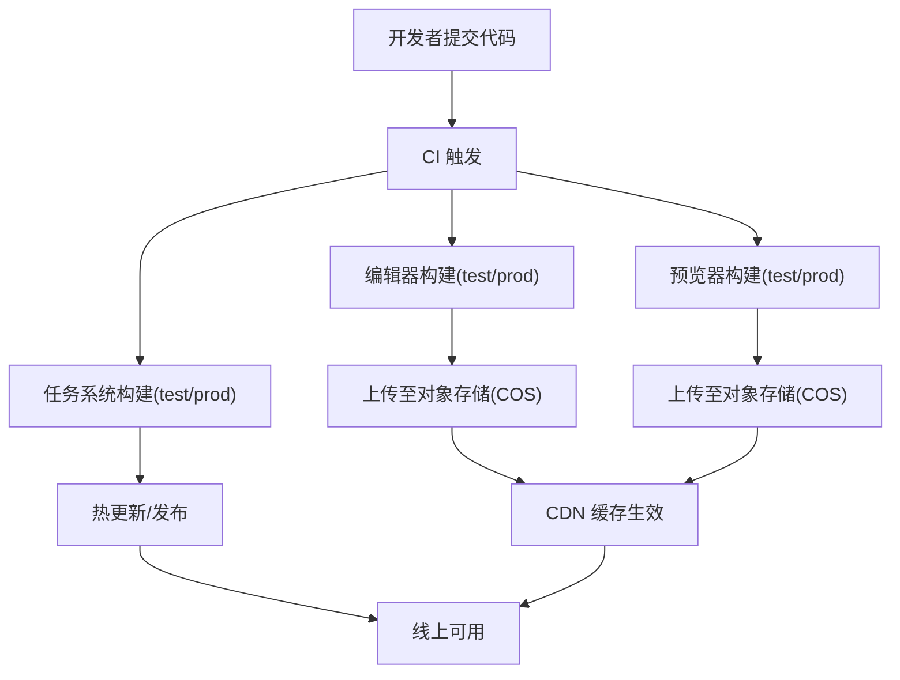

# 部署指南

<cite>
**本文引用的文件**
- [package.json](file://package.json)
- [pnpm-workspace.yaml](file://pnpm-workspace.yaml)
- [editor/package.json](file://editor/package.json)
- [editor/vite.config.ts](file://editor/vite.config.ts)
- [editor/scripts/fonts.js](file://editor/scripts/fonts.js)
- [preview/package.json](file://preview/package.json)
- [preview/scripts/build.js](file://preview/scripts/build.js)
- [task/package.json](file://task/package.json)
- [task/vite.config.ts](file://task/vite.config.ts)
- [task/scripts/release.cjs](file://task/scripts/release.cjs)
- [serverless/screenshot/s.fz.yaml](file://serverless/screenshot/s.fz.yaml)
- [serverless/screenshot/s.yaml](file://serverless/screenshot/s.yaml)
- [serverless/screenshot/s.prod.yaml](file://serverless/screenshot/s.prod.yaml)
- [serverless/screenshot/code/index.js](file://serverless/screenshot/code/index.js)
- [serverless/screenshot/code/package.json](file://serverless/screenshot/code/package.json)
- [play/src/App.tsx](file://play/src/App.tsx)
</cite>

## 目录
1. [简介](#简介)
2. [项目结构](#项目结构)
3. [核心组件](#核心组件)
4. [架构总览](#架构总览)
5. [详细组件分析](#详细组件分析)
6. [依赖关系分析](#依赖关系分析)
7. [性能与静态资源优化](#性能与静态资源优化)
8. [监控与日志](#监控与日志)
9. [Docker 容器化与编排](#docker-容器化与编排)
10. [CDN 与静态资源分发](#cdn-与静态资源分发)
11. [CI/CD 自动化与发布流程](#cicd-自动化与发布流程)
12. [部署故障排除与回滚策略](#部署故障排除与回滚策略)
13. [结论](#结论)

## 简介
本指南面向 Slides Engine 项目的运维与开发团队，提供从开发、测试到生产的完整部署方案，覆盖编辑器、预览器、播放器与任务系统四大应用，以及基于阿里云函数计算（FC）的 Serverless 截图服务部署与配置。同时给出 Docker 容器化思路、CDN 与静态资源优化策略、监控与日志体系、CI/CD 自动化与回滚策略，帮助团队在多环境下稳定、可重复地交付。

## 项目结构
Slides Engine 采用 monorepo 结构，使用 pnpm workspace 管理多个子包与应用。根目录通过工作区定义统一管理 editor、preview、task、play、common 及 bridge 等模块。

图表来源
- [pnpm-workspace.yaml:1-7](file://pnpm-workspace.yaml#L1-L7)
- [package.json:6-15](file://package.json#L6-L15)

章节来源
- [pnpm-workspace.yaml:1-7](file://pnpm-workspace.yaml#L1-L7)
- [package.json:1-58](file://package.json#L1-L58)

## 核心组件
- 编辑器：基于 Vite 的前端应用，支持代理后端 API、PWA 缓存与字体拷贝脚本。
- 预览器：基于 Webpack 的构建与发布流程，提供构建、上传与热更新脚本。
- 任务系统：基于 Vite 的前端应用，提供开发、测试与生产构建脚本。
- 播放器演示：最小化示例，用于演示设计器与渲染引擎集成。
- Serverless 截图服务：基于阿里云 FC 的 Node.js 函数，使用 Puppeteer 截图并上传至对象存储，回调业务系统。

章节来源
- [editor/package.json:1-64](file://editor/package.json#L1-L64)
- [preview/package.json:1-168](file://preview/package.json#L1-L168)
- [task/package.json:1-57](file://task/package.json#L1-L57)
- [play/src/App.tsx:1-339](file://play/src/App.tsx#L1-L339)
- [serverless/screenshot/code/index.js:1-153](file://serverless/screenshot/code/index.js#L1-L153)

## 架构总览
整体部署由“前端应用 + Serverless 服务 + 对象存储”构成。前端应用在不同环境通过环境变量与构建模式区分；Serverless 截图服务接收请求，渲染指定页面并截图上传，最后回调业务系统。

图表来源
- [serverless/screenshot/s.yaml:1-60](file://serverless/screenshot/s.yaml#L1-L60)
- [serverless/screenshot/s.fz.yaml:1-61](file://serverless/screenshot/s.fz.yaml#L1-L61)
- [serverless/screenshot/s.prod.yaml:1-61](file://serverless/screenshot/s.prod.yaml#L1-L61)
- [serverless/screenshot/code/index.js:1-153](file://serverless/screenshot/code/index.js#L1-L153)

## 详细组件分析

### 编辑器部署
- 开发环境
  - 启动命令：使用 Vite，端口 5175，代理 /api 到测试后端。
  - 环境变量目录：env。
  - 字体拷贝：构建前自动将字体资源复制到 public/fonts。
- 测试/生产环境
  - 构建产物输出到 dist/<版本号>，支持 --mode test/prod。
  - PWA 注册与缓存策略按版本号命名 sw 文件，字体资源长期缓存。
- 关键配置
  - 代理目标地址、PWA 工作线程、字体缓存策略、版本化输出目录。

图表来源
- [editor/vite.config.ts:18-29](file://editor/vite.config.ts#L18-L29)
- [editor/package.json:8-10](file://editor/package.json#L8-L10)

章节来源
- [editor/vite.config.ts:1-76](file://editor/vite.config.ts#L1-L76)
- [editor/package.json:1-64](file://editor/package.json#L1-L64)
- [editor/scripts/fonts.js:1-28](file://editor/scripts/fonts.js#L1-L28)

### 预览器部署
- 构建流程
  - 使用 Webpack 生产构建，清理旧产物并复制 public 目录。
  - 支持生成 bundle 统计与 gzip 大小告警。
- 发布流程
  - 提供 upload 与 upload:prod 脚本，结合 COS SDK 将 dist 内容上传至对象存储。
  - 支持移动 dist 与打包 zip 的辅助脚本。
- 关键配置
  - 构建入口、输出目录、Jest 测试配置、Babel 预设。

图表来源
- [preview/scripts/build.js:14-218](file://preview/scripts/build.js#L14-L218)
- [preview/package.json:76-88](file://preview/package.json#L76-L88)

章节来源
- [preview/package.json:1-168](file://preview/package.json#L1-L168)
- [preview/scripts/build.js:1-218](file://preview/scripts/build.js#L1-L218)

### 任务系统部署
- 开发与构建
  - 开发端口 5176，支持 /api 与 /test 代理。
  - 构建输出到 dist/<版本号>，提供 test/prod 构建与热更新脚本。
- 关键配置
  - 代理规则、别名 @ 指向 src、版本化输出目录。

图表来源
- [task/vite.config.ts:20-35](file://task/vite.config.ts#L20-L35)
- [task/package.json:7-12](file://task/package.json#L7-L12)

章节来源
- [task/package.json:1-57](file://task/package.json#L1-L57)
- [task/vite.config.ts:1-37](file://task/vite.config.ts#L1-L37)

### 播放器演示部署
- 演示内容
  - 展示设计器与渲染引擎的集成方式，便于本地验证渲染链路。
- 部署建议
  - 作为独立站点或内嵌页面，按需选择构建与发布策略。

章节来源
- [play/src/App.tsx:1-339](file://play/src/App.tsx#L1-L339)

### Serverless 截图服务部署与配置
- 服务定位
  - 部署于阿里云 FC，使用 Node.js 运行时与 Puppeteer 层，定时/异步触发。
- 环境变量与参数
  - COS_SECRET_ID/COS_SECRET_KEY、COS_BUCKET、COS_REGION、HOST、SHOT_URL 等。
  - 触发器类型为 HTTP，匿名访问，支持多种方法。
- 执行流程
  - 初始化浏览器实例，注入页面变量，设置视口，等待渲染完成，截图并上传至 COS，回调业务系统接口。
- 部署配置
  - 提供 s.yaml（通用）、s.fz.yaml（测试）与 s.prod.yaml（生产）三套配置，分别对应不同环境的函数名、环境变量与触发器。

图表来源
- [serverless/screenshot/s.yaml:4-61](file://serverless/screenshot/s.yaml#L4-L61)
- [serverless/screenshot/s.fz.yaml:4-61](file://serverless/screenshot/s.fz.yaml#L4-L61)
- [serverless/screenshot/s.prod.yaml:4-61](file://serverless/screenshot/s.prod.yaml#L4-L61)
- [serverless/screenshot/code/index.js:120-153](file://serverless/screenshot/code/index.js#L120-L153)

章节来源
- [serverless/screenshot/s.yaml:1-60](file://serverless/screenshot/s.yaml#L1-L60)
- [serverless/screenshot/s.fz.yaml:1-61](file://serverless/screenshot/s.fz.yaml#L1-L61)
- [serverless/screenshot/s.prod.yaml:1-61](file://serverless/screenshot/s.prod.yaml#L1-L61)
- [serverless/screenshot/code/index.js:1-153](file://serverless/screenshot/code/index.js#L1-L153)
- [serverless/screenshot/code/package.json:1-8](file://serverless/screenshot/code/package.json#L1-L8)

## 依赖关系分析
- 工作区与脚本
  - 根 package.json 定义工作区与顶层脚本，如 play/preview 等。
  - 各应用 package.json 定义自身构建、预览与发布脚本。
- 应用间依赖
  - 编辑器依赖 @play/render、@slide/* 等工作区包。
  - 任务系统依赖 @play/render、@slide/* 等工作区包。
  - 预览器与播放器演示依赖相应工作区包。
- Serverless 依赖
  - 截图函数依赖 axios、cos-nodejs-sdk-v5、uuid 等。

图表来源
- [package.json:6-15](file://package.json#L6-L15)
- [editor/package.json:17-30](file://editor/package.json#L17-L30)
- [task/package.json:13-23](file://task/package.json#L13-L23)
- [preview/package.json:10-14](file://preview/package.json#L10-L14)
- [play/src/App.tsx:22-32](file://play/src/App.tsx#L22-L32)

章节来源
- [package.json:1-58](file://package.json#L1-L58)
- [editor/package.json:1-64](file://editor/package.json#L1-L64)
- [task/package.json:1-57](file://task/package.json#L1-L57)
- [preview/package.json:1-168](file://preview/package.json#L1-L168)
- [play/src/App.tsx:1-339](file://play/src/App.tsx#L1-L339)

## 性能与静态资源优化
- 编辑器
  - PWA：按版本号命名 sw 文件，字体资源采用 CacheFirst 策略，长期缓存。
  - 字体拷贝：构建前复制字体资源到 public/fonts，避免运行时网络加载。
- 预览器
  - Webpack 生产构建，gzip 大小告警阈值配置，便于识别体积异常。
- 任务系统
  - 版本化输出目录，利于 CDN 缓存与回滚。
- Serverless 截图
  - 设置视口尺寸与重试机制，确保截图稳定性。

章节来源
- [editor/vite.config.ts:41-70](file://editor/vite.config.ts#L41-L70)
- [editor/scripts/fonts.js:1-28](file://editor/scripts/fonts.js#L1-L28)
- [preview/scripts/build.js:35-38](file://preview/scripts/build.js#L35-L38)
- [task/vite.config.ts:9-12](file://task/vite.config.ts#L9-L12)
- [serverless/screenshot/code/index.js:52-114](file://serverless/screenshot/code/index.js#L52-L114)

## 监控与日志
- Serverless 截图服务
  - 启用实例指标与请求指标，日志投递至指定项目与日志库。
  - 函数超时时间、并发度与内存大小按需求配置。
- 建议
  - 在业务回调处增加错误上报与重试机制，记录截图路径与状态码。
  - 对 Puppeteer 渲染过程增加关键日志点，便于定位页面渲染问题。

章节来源
- [serverless/screenshot/s.yaml:10-16](file://serverless/screenshot/s.yaml#L10-L16)
- [serverless/screenshot/s.fz.yaml:10-16](file://serverless/screenshot/s.fz.yaml#L10-L16)
- [serverless/screenshot/s.prod.yaml:10-16](file://serverless/screenshot/s.prod.yaml#L10-L16)
- [serverless/screenshot/code/index.js:120-153](file://serverless/screenshot/code/index.js#L120-L153)

## Docker 容器化与编排
- 容器镜像构建建议
  - 编辑器/预览器/任务系统：基于 Node.js 基础镜像，安装依赖后构建产物，使用 Nginx 静态服务镜像运行。
  - 截图服务：不建议容器化运行 Puppeteer，优先使用 Serverless FC。
- 容器编排建议
  - 使用 Kubernetes 部署前端应用，配置 Ingress、HPA、ConfigMap 与 Secret。
  - 为每个应用设置独立命名空间与资源配额，启用健康检查与就绪探针。
- 静态资源
  - 构建产物 dist/<版本号>，通过 CDN 分发，版本化路径便于缓存与回滚。

章节来源
- [editor/package.json:8-10](file://editor/package.json#L8-L10)
- [preview/package.json:76-88](file://preview/package.json#L76-L88)
- [task/package.json:7-12](file://task/package.json#L7-L12)
- [serverless/screenshot/s.yaml:26-28](file://serverless/screenshot/s.yaml#L26-L28)

## CDN 与静态资源分发
- 版本化路径
  - 编辑器与任务系统均输出到 dist/<版本号>，便于 CDN 缓存与灰度回滚。
- 缓存策略
  - 编辑器对字体资源采用长期缓存策略，减少带宽消耗。
- 发布流程
  - 预览器提供上传脚本，将 dist 内容上传至对象存储，配合 CDN 加速。

章节来源
- [editor/vite.config.ts:30-38](file://editor/vite.config.ts#L30-L38)
- [task/vite.config.ts:10-12](file://task/vite.config.ts#L10-L12)
- [preview/package.json:81-82](file://preview/package.json#L81-L82)

## CI/CD 自动化与发布流程
- 编辑器
  - dev/build/build:prod：按模式构建，PWA 与字体资源准备。
- 预览器
  - build/build:prod：生产构建；upload/upload:prod：上传至对象存储；release/release:prod：构建并上传。
- 任务系统
  - dev/build:test/build:prod：按模式构建；hotUpdate/test/release:test：热更新与发布。
- 发布脚本
  - 任务系统提供 COS 上传脚本，递归遍历 dist/<版本号> 并上传至指定前缀。

图表来源
- [editor/package.json:8-10](file://editor/package.json#L8-L10)
- [preview/package.json:76-88](file://preview/package.json#L76-L88)
- [task/package.json:6-12](file://task/package.json#L6-L12)
- [task/scripts/release.cjs:14-67](file://task/scripts/release.cjs#L14-L67)

章节来源
- [editor/package.json:1-64](file://editor/package.json#L1-L64)
- [preview/package.json:1-168](file://preview/package.json#L1-L168)
- [task/package.json:1-57](file://task/package.json#L1-L57)
- [task/scripts/release.cjs:1-67](file://task/scripts/release.cjs#L1-L67)

## 部署故障排除与回滚策略
- 常见问题
  - 编辑器代理失败：检查 /api 代理目标与 changeOrigin/rewrite 配置。
  - 预览器构建失败：查看 Webpack 错误信息与 sourcemap 解析告警。
  - 任务系统代理失败：确认 /api 与 /test 代理目标域名可达。
  - 截图函数超时：调整超时时间、内存大小与并发度，检查 Puppeteer 初始化与页面渲染。
- 回滚策略
  - 版本化发布：dist/<版本号> 便于快速回滚至上一版本。
  - 对象存储：保留历史版本，CDN 缓存失效后回源至上一版本路径。
  - Serverless：切换到上一版本函数或降级至备用触发器。

章节来源
- [editor/vite.config.ts:18-29](file://editor/vite.config.ts#L18-L29)
- [preview/scripts/build.js:111-132](file://preview/scripts/build.js#L111-L132)
- [task/vite.config.ts:20-35](file://task/vite.config.ts#L20-L35)
- [serverless/screenshot/s.yaml:24-32](file://serverless/screenshot/s.yaml#L24-L32)

## 结论
本部署指南提供了从开发到生产的全链路实践建议：前端应用通过版本化构建与 CDN 缓存提升性能与可靠性；Serverless 截图服务以低运维成本实现高并发截图能力；结合对象存储与代理策略，满足多环境差异化部署需求。建议在 CI/CD 中固化构建与发布流程，并完善监控与回滚策略，确保线上稳定运行。