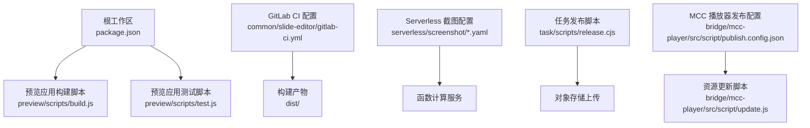
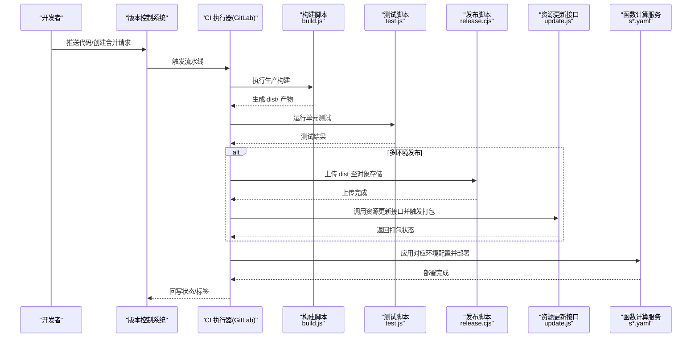
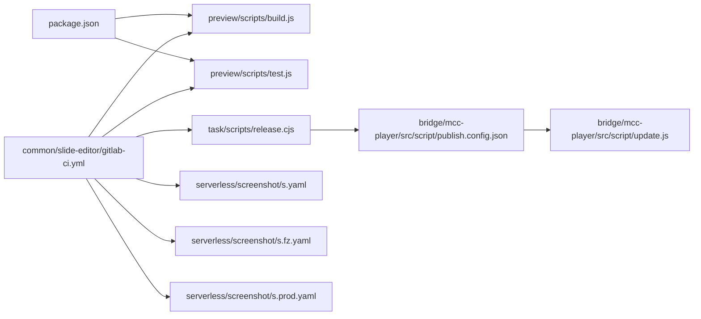

# 部署自动化

<cite>
**本文引用的文件**
- [package.json](file://package.json)
- [gitlab-ci.yml](file://common/slide-editor/gitlab-ci.yml)
- [s.yaml](file://serverless/screenshot/s.yaml)
- [s.fz.yaml](file://serverless/screenshot/s.fz.yaml)
- [s.prod.yaml](file://serverless/screenshot/s.prod.yaml)
- [build.js](file://preview/scripts/build.js)
- [test.js](file://preview/scripts/test.js)
- [release.cjs](file://task/scripts/release.cjs)
- [publish.config.json](file://bridge/mcc-player/src/script/publish.config.json)
- [update.js](file://bridge/mcc-player/src/script/update.js)
</cite>

## 目录
1. [简介](#简介)
2. [项目结构](#项目结构)
3. [核心组件](#核心组件)
4. [架构总览](#架构总览)
5. [详细组件分析](#详细组件分析)
6. [依赖关系分析](#依赖关系分析)
7. [性能考量](#性能考量)
8. [故障排查指南](#故障排查指南)
9. [结论](#结论)
10. [附录](#附录)

## 简介
本文件面向 Slides Engine 项目的部署自动化与 CI/CD 流程，结合仓库内现有配置与脚本，系统性说明如何设计与落地自动化构建、测试、打包与发布流程；覆盖多环境（开发/测试/生产）自动部署策略、分支保护与版本发布规范、回滚机制建议、代码质量与安全扫描、性能测试集成、部署策略选择（蓝绿/滚动/金丝雀）、失败处理与通知、以及部署权限与审计日志的配置思路。内容以仓库实际文件为依据，避免臆测，便于不同技术背景读者理解与落地。

## 项目结构
Slides Engine 采用多包工作区组织方式，根目录通过工作区配置统一管理多个前端应用与组件库。与部署自动化直接相关的关键位置如下：
- 根级工作区与脚本：用于统一启动各子应用与安装 husky 钩子
- 预览应用构建与测试脚本：提供生产构建与测试入口
- GitLab CI 配置：定义构建、测试、镜像构建与部署阶段
- Serverless 截图函数配置：定义函数计算服务、触发器与环境变量
- 任务发布脚本与资源更新脚本：负责产物上传与资源注册

图表来源
- [package.json:1-58](file://package.json#L1-L58)
- [gitlab-ci.yml:1-76](file://common/slide-editor/gitlab-ci.yml#L1-L76)
- [build.js:1-218](file://preview/scripts/build.js#L1-L218)
- [test.js:1-53](file://preview/scripts/test.js#L1-L53)
- [s.yaml:1-60](file://serverless/screenshot/s.yaml#L1-L60)
- [s.fz.yaml:1-61](file://serverless/screenshot/s.fz.yaml#L1-L61)
- [s.prod.yaml:1-61](file://serverless/screenshot/s.prod.yaml#L1-L61)
- [release.cjs:1-67](file://task/scripts/release.cjs#L1-L67)
- [publish.config.json:1-16](file://bridge/mcc-player/src/script/publish.config.json#L1-L16)
- [update.js:1-59](file://bridge/mcc-player/src/script/update.js#L1-L59)

章节来源
- [package.json:1-58](file://package.json#L1-L58)
- [gitlab-ci.yml:1-76](file://common/slide-editor/gitlab-ci.yml#L1-L76)

## 核心组件
- 工作区与脚本
  - 根工作区定义了多个工作区路径，统一提供本地开发与启动命令，便于在 CI 中按需执行构建或测试。
- 预览应用构建与测试
  - 构建脚本负责生产构建、体积报告与错误处理；测试脚本负责单元测试与监听模式控制。
- GitLab CI
  - 定义构建、测试、镜像构建与部署四个阶段，并通过环境变量注入与 artifacts 传递产物。
- Serverless 截图函数
  - 通过 YAML 配置函数计算服务、运行时、环境变量与触发器，支持多环境配置文件。
- 任务发布与资源更新
  - 通过 COS SDK 将 dist 产物上传至对象存储，并调用后端接口完成资源登记与打包。

章节来源
- [package.json:16-23](file://package.json#L16-L23)
- [build.js:135-210](file://preview/scripts/build.js#L135-L210)
- [test.js:18-53](file://preview/scripts/test.js#L18-L53)
- [gitlab-ci.yml:1-76](file://common/slide-editor/gitlab-ci.yml#L1-L76)
- [s.yaml:1-60](file://serverless/screenshot/s.yaml#L1-L60)
- [s.fz.yaml:1-61](file://serverless/screenshot/s.fz.yaml#L1-L61)
- [s.prod.yaml:1-61](file://serverless/screenshot/s.prod.yaml#L1-L61)
- [release.cjs:14-66](file://task/scripts/release.cjs#L14-L66)
- [publish.config.json:1-16](file://bridge/mcc-player/src/script/publish.config.json#L1-L16)
- [update.js:14-58](file://bridge/mcc-player/src/script/update.js#L14-L58)

## 架构总览
下图展示从代码提交到多环境部署的整体流程，涵盖构建、测试、制品上传与资源注册、以及 Serverless 函数部署。

图表来源
- [gitlab-ci.yml:1-76](file://common/slide-editor/gitlab-ci.yml#L1-L76)
- [build.js:135-210](file://preview/scripts/build.js#L135-L210)
- [test.js:18-53](file://preview/scripts/test.js#L18-L53)
- [release.cjs:14-66](file://task/scripts/release.cjs#L14-L66)
- [update.js:14-58](file://bridge/mcc-player/src/script/update.js#L14-L58)
- [s.yaml:1-60](file://serverless/screenshot/s.yaml#L1-L60)
- [s.fz.yaml:1-61](file://serverless/screenshot/s.fz.yaml#L1-L61)
- [s.prod.yaml:1-61](file://serverless/screenshot/s.prod.yaml#L1-L61)

## 详细组件分析

### GitLab CI 流水线设计
- 阶段划分
  - 构建：准备环境变量、安装依赖、执行构建，产出 dist/artifacts。
  - 测试：引入分支环境配置文件，执行静态分析与单元测试，允许失败以保证发布不被阻断。
  - 镜像构建与推送：基于构建产物生成镜像并推送到镜像仓库。
  - 部署：通过 SSH 登录目标服务器，停止旧容器、清理镜像、拉取新镜像并运行。
- 分支与环境
  - 仅在 develop/test/release/master 分支触发，便于多环境自动部署。
- 可扩展点
  - 建议增加 SonarQube 扫描、DAST/Secret scanning、依赖漏洞扫描等质量门禁。
  - 建议将部署阶段拆分为蓝绿/滚动/金丝雀策略，配合健康检查与回滚。

章节来源
- [gitlab-ci.yml:1-76](file://common/slide-editor/gitlab-ci.yml#L1-L76)

### 预览应用构建与测试
- 构建流程
  - 设置生产环境变量、校验必要文件、调用 Webpack 生产构建、输出体积报告、打印部署指引。
  - 错误处理严格，支持类型检查与 CI 下警告转错误。
- 测试流程
  - 设置测试环境变量、根据 CI 环境决定监听模式、运行 Jest 并输出结果。

章节来源
- [build.js:135-210](file://preview/scripts/build.js#L135-L210)
- [test.js:18-53](file://preview/scripts/test.js#L18-L53)

### Serverless 截图函数配置
- 多环境配置
  - 提供测试与生产两套配置，分别指向不同服务名、函数名与环境变量。
- 关键配置项
  - 运行时、超时、内存、并发、实例类型、层、环境变量、触发器类型与方法。
- 部署建议
  - 建议在 CI 中按环境选择对应配置文件进行部署，并记录部署版本与时间戳以便回溯。

章节来源
- [s.yaml:1-60](file://serverless/screenshot/s.yaml#L1-L60)
- [s.fz.yaml:1-61](file://serverless/screenshot/s.fz.yaml#L1-L61)
- [s.prod.yaml:1-61](file://serverless/screenshot/s.prod.yaml#L1-L61)

### 任务发布与资源更新
- 上传流程
  - 读取发布配置，遍历 dist 目录，使用 COS SDK 逐文件上传，支持目录递归。
- 资源更新流程
  - 通过后端接口创建资源记录并触发打包，便于前端按版本加载资源。

章节来源
- [release.cjs:14-66](file://task/scripts/release.cjs#L14-L66)
- [publish.config.json:1-16](file://bridge/mcc-player/src/script/publish.config.json#L1-L16)
- [update.js:14-58](file://bridge/mcc-player/src/script/update.js#L14-L58)

### 部署策略与回滚机制
- 蓝绿部署
  - 同时维护两套实例，切换流量至新版本，失败则切回旧版本。
- 滚动部署
  - 分批替换实例，降低单次变更影响面。
- 金丝雀发布
  - 先对小部分流量放量，观察指标后再扩大范围。
- 回滚机制
  - 记录版本号与部署时间戳，支持一键回滚至上一稳定版本；Serverless 场景可保留历史别名或版本。

（本节为概念性说明，未直接分析具体文件）

### 代码质量、安全扫描与性能测试集成
- 代码质量
  - 在 CI 中集成 ESLint、TypeScript 类型检查与 SonarQube 扫描，作为质量门禁。
- 安全扫描
  - 引入依赖漏洞扫描（如 Snyk/OSV）、敏感信息扫描（如 Trivy/Gitleaks），失败即阻断发布。
- 性能测试
  - 在测试阶段加入 Lighthouse 或自定义性能基准测试，监控关键指标阈值。

（本节为概念性说明，未直接分析具体文件）

### 失败处理与通知
- 失败处理
  - CI 阶段失败时及时终止后续步骤，保留 artifacts 便于排查；部署失败回滚至上一版本。
- 通知
  - 在 CI 中集成企业微信/钉钉/Slack 机器人，失败时推送告警与链接至日志。

（本节为概念性说明，未直接分析具体文件）

### 权限管理与审计日志
- 权限管理
  - 限制 CI 密钥访问范围，区分测试与生产密钥；镜像仓库与对象存储使用最小权限角色。
- 审计日志
  - 记录每次部署的用户、时间、版本、IP 与操作详情，便于追溯与合规。

（本节为概念性说明，未直接分析具体文件）

## 依赖关系分析
下图展示与部署自动化相关的核心文件之间的依赖关系与数据流。

图表来源
- [package.json:1-58](file://package.json#L1-L58)
- [gitlab-ci.yml:1-76](file://common/slide-editor/gitlab-ci.yml#L1-L76)
- [build.js:1-218](file://preview/scripts/build.js#L1-L218)
- [test.js:1-53](file://preview/scripts/test.js#L1-L53)
- [release.cjs:1-67](file://task/scripts/release.cjs#L1-L67)
- [publish.config.json:1-16](file://bridge/mcc-player/src/script/publish.config.json#L1-L16)
- [update.js:1-59](file://bridge/mcc-player/src/script/update.js#L1-L59)
- [s.yaml:1-60](file://serverless/screenshot/s.yaml#L1-L60)
- [s.fz.yaml:1-61](file://serverless/screenshot/s.fz.yaml#L1-L61)
- [s.prod.yaml:1-61](file://serverless/screenshot/s.prod.yaml#L1-L61)

章节来源
- [package.json:1-58](file://package.json#L1-L58)
- [gitlab-ci.yml:1-76](file://common/slide-editor/gitlab-ci.yml#L1-L76)

## 性能考量
- 构建性能
  - 使用缓存与并行任务减少构建时间；对大依赖进行分包与懒加载。
- 部署性能
  - 采用 CDN 加速静态资源；Serverless 函数按需扩缩容，合理设置超时与内存。
- 监控与优化
  - 结合性能测试与 APM，持续优化首屏与交互性能。

（本节为通用指导，未直接分析具体文件）

## 故障排查指南
- 构建失败
  - 查看构建日志中的错误堆栈与警告；确保必要文件存在且环境变量正确。
- 测试失败
  - 在本地复现测试命令，确认依赖与 Node 版本一致；关注 CI 下的监听模式差异。
- 发布失败
  - 检查对象存储上传权限与桶配置；核对资源更新接口返回码与参数。
- 部署失败
  - 检查服务器可达性、SSH 密钥与容器端口映射；确认镜像拉取与运行参数。

章节来源
- [build.js:111-132](file://preview/scripts/build.js#L111-L132)
- [test.js:18-53](file://preview/scripts/test.js#L18-L53)
- [release.cjs:14-28](file://task/scripts/release.cjs#L14-L28)
- [update.js:35-58](file://bridge/mcc-player/src/script/update.js#L35-L58)

## 结论
本项目已具备较为完整的多包工作区与基础 CI 能力，结合现有 GitLab CI、构建与测试脚本、Serverless 配置以及发布与资源更新脚本，可快速搭建多环境自动部署流水线。建议在此基础上补充质量门禁、安全扫描、性能测试与多种部署策略（蓝绿/滚动/金丝雀），并完善失败处理与通知、权限与审计体系，以满足生产级交付要求。

## 附录
- 多环境配置建议
  - 开发：快速迭代，允许失败；测试：完整测试与扫描；生产：严格门禁与回滚策略。
- 分支保护与版本发布
  - 主干受保护，仅允许合并请求；版本发布打标签并触发生产部署。
- 部署策略选择
  - 小步快跑优先采用滚动部署；高风险变更采用蓝绿或金丝雀，并配套健康检查与自动回滚。

（本节为通用指导，未直接分析具体文件）