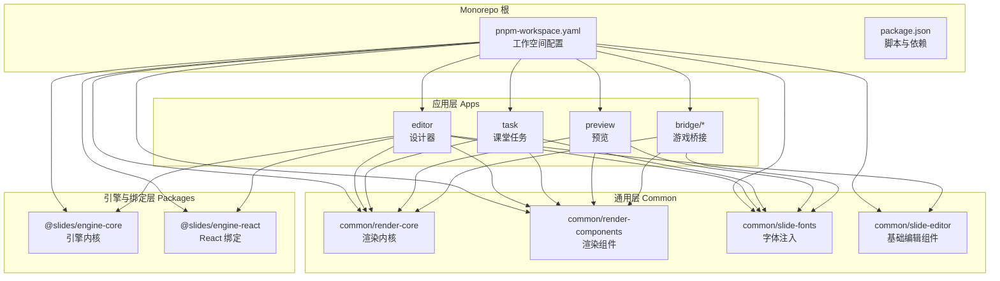
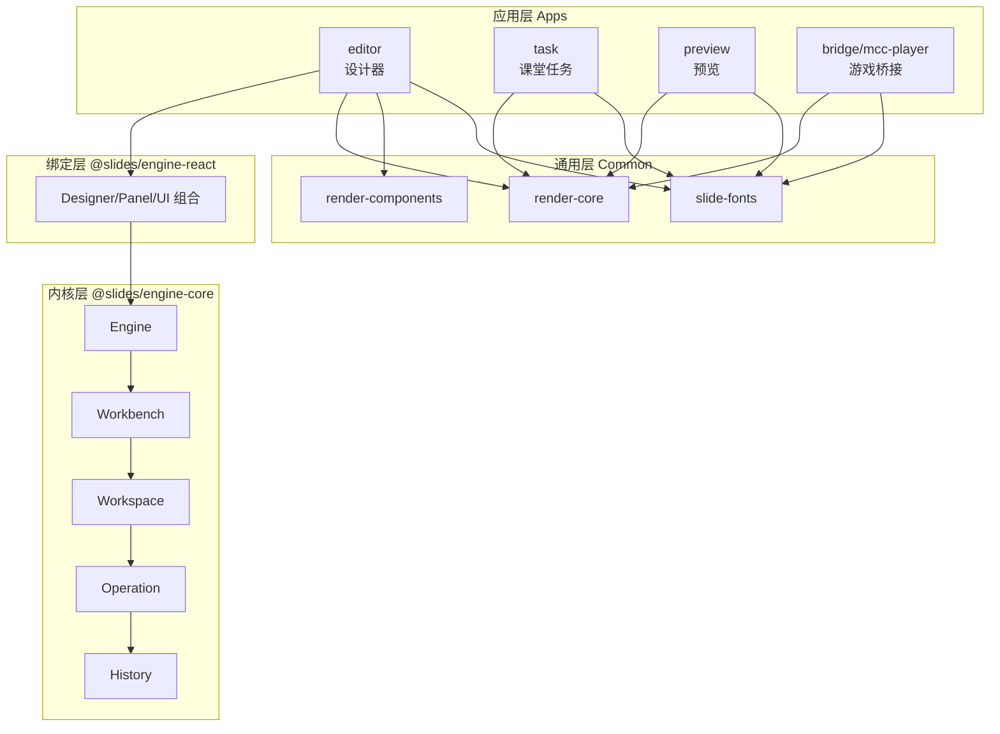
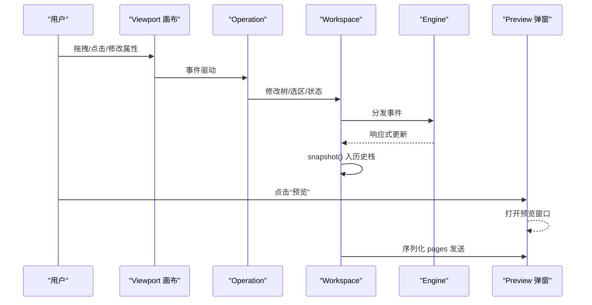
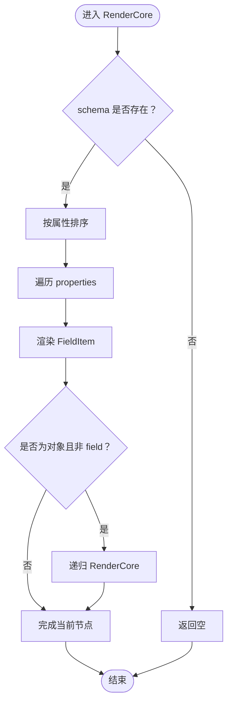
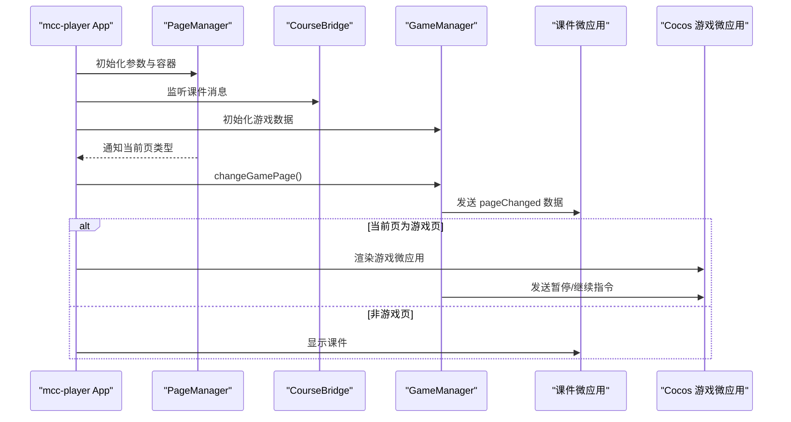
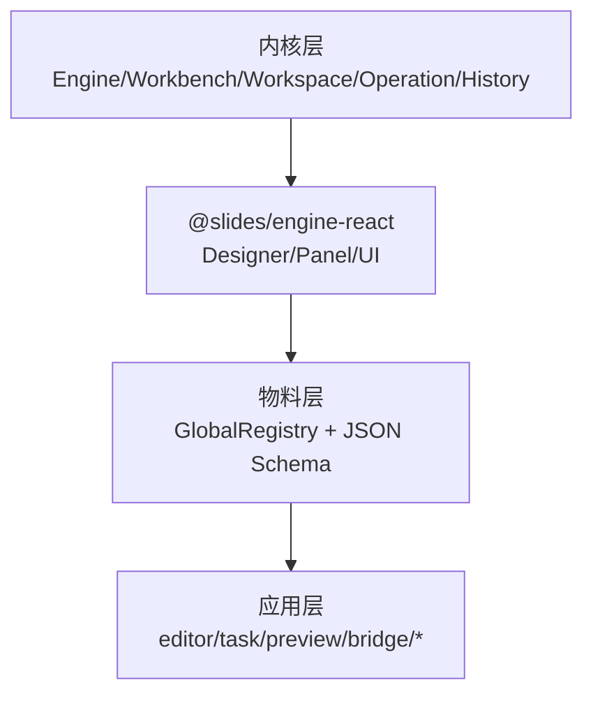
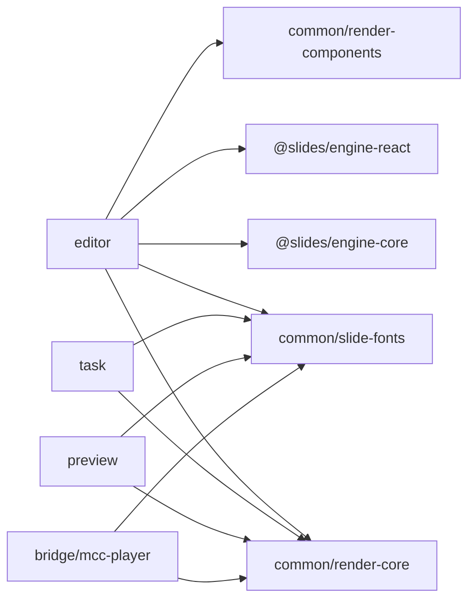

# 项目概述

<cite>
**本文引用的文件**
- [README.md](file://README.md)
- [package.json](file://package.json)
- [pnpm-workspace.yaml](file://pnpm-workspace.yaml)
- [editor/src/App.tsx](file://editor/src/App.tsx)
- [task/src/App.tsx](file://task/src/App.tsx)
- [bridge/mcc-player/src/App.ts](file://bridge/mcc-player/src/App.ts)
- [bridge/mcc-player/src/components/course-bridge/courseManager.ts](file://bridge/mcc-player/src/components/course-bridge/courseManager.ts)
- [bridge/mcc-player/src/components/game-manage/gameManager.ts](file://bridge/mcc-player/src/components/game-manage/gameManager.ts)
- [common/render-core/index.tsx](file://common/render-core/index.tsx)
- [common/render-components/src/index.ts](file://common/render-components/src/index.ts)
- [common/slide-fonts/index.ts](file://common/slide-fonts/index.ts)
- [common/slide-editor/src/App.tsx](file://common/slide-editor/src/App.tsx)
- [project-analysis/01_项目亮点总结.md](file://project-analysis/01_项目亮点总结.md)
- [project-analysis/02_架构设计分析.md](file://project-analysis/02_架构设计分析.md)
</cite>

## 目录
1. [简介](#简介)
2. [项目结构](#项目结构)
3. [核心组件](#核心组件)
4. [架构总览](#架构总览)
5. [详细组件分析](#详细组件分析)
6. [依赖分析](#依赖分析)
7. [性能考虑](#性能考虑)
8. [故障排查指南](#故障排查指南)
9. [结论](#结论)
10. [附录](#附录)

## 简介
Slides Engine 是一套面向教学场景的“交互式课件”低代码引擎，覆盖“课件设计—渲染播放—课堂任务—游戏桥接”的全链路。项目采用 Monorepo 架构，通过“引擎内核与 UI 解耦、行为注册表、双视口与工作区隔离”等设计，实现编辑器、预览、课堂任务与游戏桥接系统的协同工作。

- 业务价值：以“组件化课件 DSL + 低代码画布内核”为核心，支持富文本、图片、视频、形状、摄像头、游戏等教学物料的统一设计与渲染，并可扩展至课堂任务编排与原生游戏容器播放。
- 技术价值：内核与 UI 解耦、跨端协议（post-me、微前端）、运行时双形态动画、历史快照与撤销、物料注册表与 JSON Schema 驱动的属性面板。

**章节来源**
- [project-analysis/01_项目亮点总结.md:1-85](file://project-analysis/01_项目亮点总结.md#L1-L85)
- [project-analysis/02_架构设计分析.md:1-114](file://project-analysis/02_架构设计分析.md#L1-L114)

## 项目结构
项目采用 pnpm workspace 管理多包，核心目录与职责概览如下：

- apps 层（应用层）
  - editor：课件设计器，负责组件拖拽、属性设置、动画与预览。
  - preview：独立预览页，接收编辑端序列化数据进行渲染。
  - task：课堂任务系统，承载课程、任务、预览与编辑预览等功能。
  - bridge/*：游戏桥接相关应用与组件，如 mcc-player、mcc-demo。
- common/*：通用渲染与物料组件，如 render-core、render-components、slide-editor、slide-shape、slide-fonts、slide-shot。
- packages/*：引擎与 React 绑定层，如 core、react、react-settings-form、shared、typings。
- serverless：截图能力的 Serverless 包装。
- test：测试脚本集合。

**图表来源**
- [pnpm-workspace.yaml:1-7](file://pnpm-workspace.yaml#L1-L7)
- [package.json:1-58](file://package.json#L1-L58)

**章节来源**
- [pnpm-workspace.yaml:1-7](file://pnpm-workspace.yaml#L1-L7)
- [package.json:1-58](file://package.json#L1-L58)
- [README.md:1-17](file://README.md#L1-L17)

## 核心组件
- 设计器（editor）：提供菜单、工具栏、画布、大纲树、属性面板、动画面板与预览弹窗，基于 @slides/engine-react 与 @slides/engine-core 构建。
- 渲染内核（common/render-core）：以 schema 驱动的渲染管线，支持排序、Provider 包裹与内置小部件，形成“树 JSON → 渲染树”的映射。
- 渲染组件（common/render-components）：图像、视频等基础渲染组件导出入口。
- 字体注入（common/slide-fonts）：集中注入多种字体格式，确保跨端一致性。
- 课堂任务（task）：路由驱动的课堂任务界面，提供课程、任务、预览与编辑预览。
- 游戏桥接（bridge/mcc-player）：通过微前端与消息通道，实现课件与 Cocos 游戏的切换与数据通信。
- 渲染组件（common/slide-editor）：基础输入组件示例，用于演示组件化与样式体系。

**章节来源**
- [editor/src/App.tsx:1-230](file://editor/src/App.tsx#L1-L230)
- [common/render-core/index.tsx:1-76](file://common/render-core/index.tsx#L1-L76)
- [common/render-components/src/index.ts:1-3](file://common/render-components/src/index.ts#L1-L3)
- [common/slide-fonts/index.ts:1-71](file://common/slide-fonts/index.ts#L1-L71)
- [task/src/App.tsx:1-25](file://task/src/App.tsx#L1-L25)
- [bridge/mcc-player/src/App.ts:1-200](file://bridge/mcc-player/src/App.ts#L1-L200)
- [common/slide-editor/src/App.tsx:1-33](file://common/slide-editor/src/App.tsx#L1-L33)

## 架构总览
整体采用“内核层（引擎）—绑定层（React）—物料层（注册表）—应用层（apps）”的分层设计。编辑器、预览、课堂任务、桥接应用共享同一套“树 JSON”协议，通过 post-me 或微前端在不同宿主中运行。

**图表来源**
- [project-analysis/02_架构设计分析.md:5-32](file://project-analysis/02_架构设计分析.md#L5-L32)
- [project-analysis/02_架构设计分析.md:74-96](file://project-analysis/02_架构设计分析.md#L74-L96)

**章节来源**
- [project-analysis/02_架构设计分析.md:1-114](file://project-analysis/02_架构设计分析.md#L1-L114)

## 详细组件分析

### 设计器（editor）组件分析
- 职责：装配 Designer、Toolbar、MainLayoutPanel、Viewport、Outline、SettingsForm、AnimationWidget、Preview 等，提供保存、预览、字体注入、资源 CDN 等能力。
- 数据流：用户在画布操作触发事件，经 Engine/Workbench/Workspace/Operation 修改树并生成快照，最终序列化为 JSON 供预览与课堂任务使用。
- 交互：支持拖拽、移动、变换、选择、历史撤销、动画面板与属性设置面板联动。

**图表来源**
- [project-analysis/02_架构设计分析.md:56-62](file://project-analysis/02_架构设计分析.md#L56-L62)
- [editor/src/App.tsx:107-120](file://editor/src/App.tsx#L107-L120)

**章节来源**
- [editor/src/App.tsx:1-230](file://editor/src/App.tsx#L1-L230)
- [project-analysis/02_架构设计分析.md:43-62](file://project-analysis/02_架构设计分析.md#L43-L62)

### 渲染内核（common/render-core）组件分析
- 职责：以 schema 驱动渲染，提供 RenderCore、RenderRoot、withProvider、内置小部件与排序逻辑，支持跨页面渲染与 Provider 包裹。
- 数据结构：schemaIF 定义 ui:widget 与 props/properties，FieldItem 作为渲染节点包装，withProvider2 提供上下文。
- 复杂度：渲染树遍历为 O(N)，排序与 Provider 包裹为轻量开销；适合大体量课件的稳定渲染。

**图表来源**
- [common/render-core/index.tsx:28-65](file://common/render-core/index.tsx#L28-L65)

**章节来源**
- [common/render-core/index.tsx:1-76](file://common/render-core/index.tsx#L1-L76)

### 渲染组件（common/render-components）与字体注入（common/slide-fonts）
- 渲染组件：统一导出图像与视频组件，作为渲染内核的物料补充。
- 字体注入：集中注入多种字体格式，确保跨端一致显示；提供 fontBootstrap、fontConfigList 等工具。

**章节来源**
- [common/render-components/src/index.ts:1-3](file://common/render-components/src/index.ts#L1-L3)
- [common/slide-fonts/index.ts:1-71](file://common/slide-fonts/index.ts#L1-L71)

### 课堂任务（task）组件分析
- 职责：路由驱动的课堂任务界面，提供课程、任务、预览与编辑预览，使用 Ant Design 与字体注入。
- 交互：通过路由切换页面，承载课堂任务编排与预览能力。

**章节来源**
- [task/src/App.tsx:1-25](file://task/src/App.tsx#L1-L25)

### 游戏桥接（bridge/mcc-player）组件分析
- 职责：通过微前端与消息通道，实现课件与 Cocos 游戏的切换、参数传递与生命周期管理。
- 课件桥接（CourseBridge）：封装与课件应用的数据监听与消息发送，支持翻页、恢复状态、尺寸调整等。
- 游戏管理（GameManager）：负责游戏包加载、预加载、切页、暂停/继续、资源路径解析与埋点上报。

**图表来源**
- [bridge/mcc-player/src/App.ts:54-90](file://bridge/mcc-player/src/App.ts#L54-L90)
- [bridge/mcc-player/src/components/course-bridge/courseManager.ts:40-103](file://bridge/mcc-player/src/components/course-bridge/courseManager.ts#L40-L103)
- [bridge/mcc-player/src/components/game-manage/gameManager.ts:200-260](file://bridge/mcc-player/src/components/game-manage/gameManager.ts#L200-L260)

**章节来源**
- [bridge/mcc-player/src/App.ts:1-200](file://bridge/mcc-player/src/App.ts#L1-L200)
- [bridge/mcc-player/src/components/course-bridge/courseManager.ts:1-117](file://bridge/mcc-player/src/components/course-bridge/courseManager.ts#L1-L117)
- [bridge/mcc-player/src/components/game-manage/gameManager.ts:1-368](file://bridge/mcc-player/src/components/game-manage/gameManager.ts#L1-L368)

### 概念总览
- 低代码画布内核：以“可观察组件树 + 行为注册表 + 工作区隔离”为核心，支持多页面、多视口与历史撤销。
- 跨端协议：post-me 双向握手与微前端路由 attach，确保编辑端与预览/课堂端的一致渲染。
- 动画与任务：运行时双形态动画（编辑/预览）与 Rematch 管理的任务状态，支撑课堂节奏与互动。

**图表来源**
- [project-analysis/02_架构设计分析.md:34-40](file://project-analysis/02_架构设计分析.md#L34-L40)

## 依赖分析
- Monorepo 边界：pnpm-workspace.yaml 收录 packages/*、editor、common/*、preview、task、bridge/*，明确各包职责与依赖方向。
- 关键依赖：@slides/engine-core、@slides/engine-react、@slides/reactive、@ld/micro-app、antd、post-me 等。
- 跨端通信：编辑端与预览使用 post-me 握手；课堂任务与桥接使用微前端与消息通道。

**图表来源**
- [pnpm-workspace.yaml:1-7](file://pnpm-workspace.yaml#L1-L7)
- [project-analysis/02_架构设计分析.md:74-84](file://project-analysis/02_架构设计分析.md#L74-L84)

**章节来源**
- [pnpm-workspace.yaml:1-7](file://pnpm-workspace.yaml#L1-L7)
- [project-analysis/02_架构设计分析.md:74-96](file://project-analysis/02_架构设计分析.md#L74-L96)

## 性能考虑
- 历史与快照：History 对 Operation 进行序列化并入栈，snapshot 通过 idle 合并，避免频繁入栈导致卡顿。
- 渲染优化：RenderCore 对属性排序与 Provider 包裹为常数级开销；建议在大体量课件中避免不必要的重渲染。
- 资源加载：字体注入集中处理，减少重复请求；游戏桥接按需加载与预加载策略可降低首帧延迟。
- 跨端通信：post-me 与微前端均需在 load 后建立连接，避免 remoteHandle 无效导致的消息丢失。

**章节来源**
- [project-analysis/01_项目亮点总结.md:45-50](file://project-analysis/01_项目亮点总结.md#L45-L50)
- [project-analysis/02_架构设计分析.md:65-71](file://project-analysis/02_架构设计分析.md#L65-L71)

## 故障排查指南
- 预览握手失败：确认 iframe 已 load 再建立 WindowMessenger，避免 remoteHandle 无效。
- 多设计器上下文：确保 React 树中仅存在一个 DesignerEngineContext，防止状态串台。
- 历史与快照异常：当 history.locking 或 workspace 缺失时 snapshot 会直接返回，检查当前 workspace 与锁定状态。
- 微前端与预览：PostMessageClient 在 preview 模式使用 BroadcastChannel，宿主模式走 window.microApp，分支错误会导致消息丢失无声失败。

**章节来源**
- [project-analysis/01_项目亮点总结.md:65-71](file://project-analysis/01_项目亮点总结.md#L65-L71)

## 结论
Slides Engine 通过“内核与 UI 解耦 + 行为注册表 + 工作区隔离 + 跨端协议”，构建了可扩展的教学课件低代码平台。其在教育科技领域的价值体现在：统一的组件化 DSL、稳定的跨端渲染协议、课堂任务编排与原生游戏桥接能力。对于初学者，建议从设计器与渲染内核入手；对于有经验的开发者，可关注注册表扩展、跨端通信与性能优化。

## 附录

### 快速入门指南
- 环境要求
  - Node.js 与 pnpm（根据项目配置）
  - 浏览器支持现代 ES 模块与微前端
- 安装步骤
  - 安装依赖：在仓库根目录执行安装命令（使用 pnpm workspace 管理多包）
  - 启动设计器：执行设计器脚本，打开编辑器页面
  - 启动预览：执行预览脚本，打开独立预览页
  - 启动课堂任务：执行任务脚本，打开课堂任务界面
  - 启动游戏桥接：执行桥接应用脚本，打开 mcc-player 页面
- 基本使用流程
  - 在设计器中创建页面、拖拽组件、设置属性与动画
  - 点击“预览”查看渲染效果
  - 在课堂任务中打开课程与任务，进行课堂编排
  - 在游戏桥接中切换课件与游戏，查看资源加载与生命周期

**章节来源**
- [package.json:16-22](file://package.json#L16-L22)
- [editor/src/App.tsx:107-120](file://editor/src/App.tsx#L107-L120)
- [task/src/App.tsx:14-22](file://task/src/App.tsx#L14-L22)
- [bridge/mcc-player/src/App.ts:15-29](file://bridge/mcc-player/src/App.ts#L15-L29)