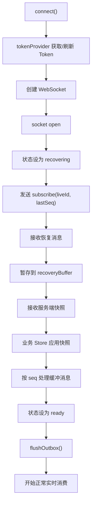
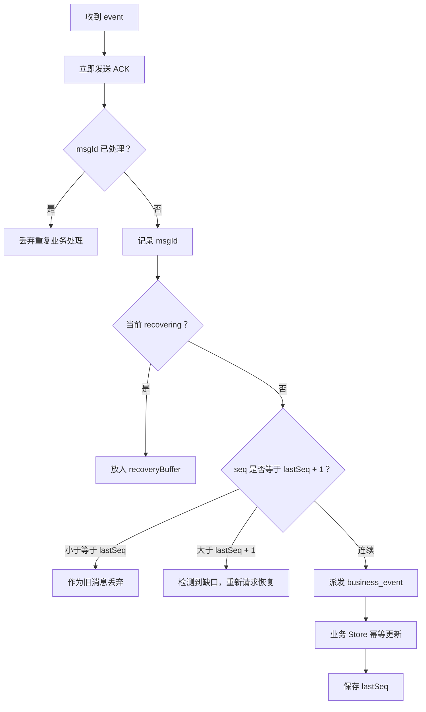
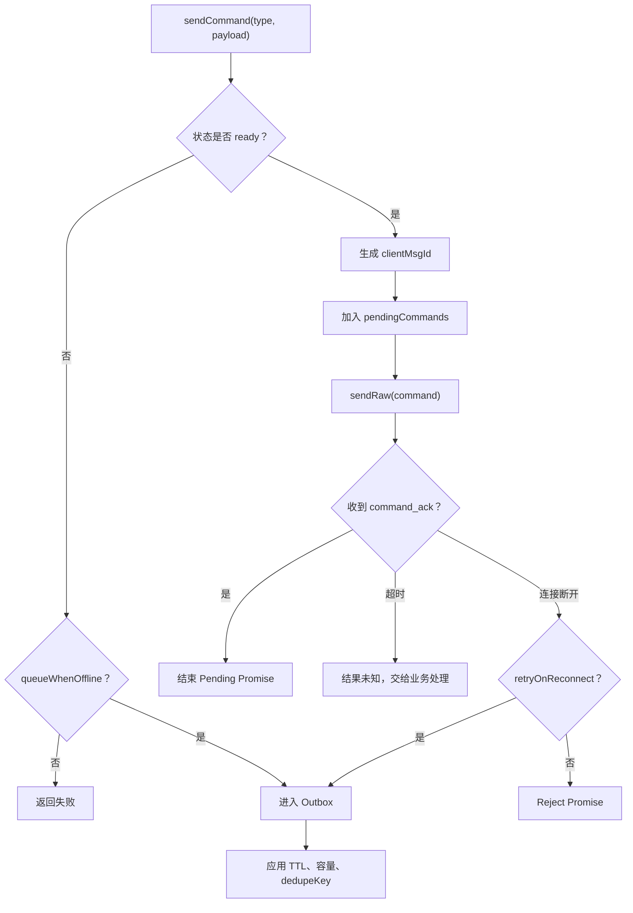
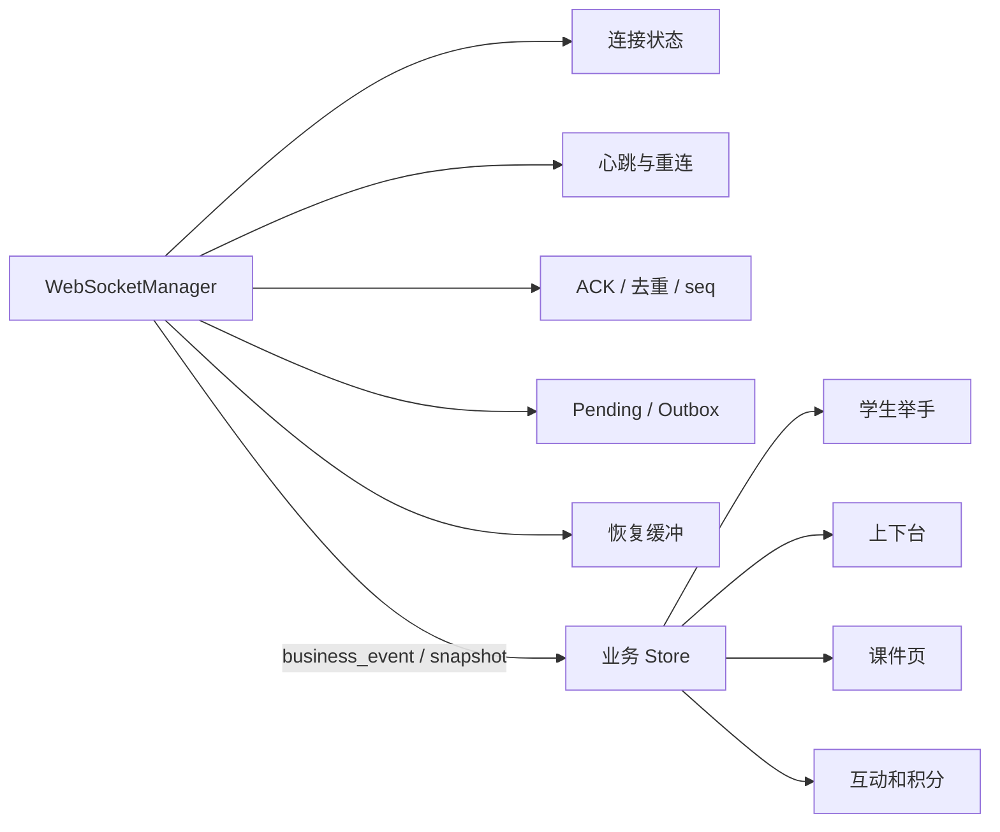

# 授课端 WebSocket 生产化实验场

这是一个可以作为真实项目基础模块继续接入的前端实现，同时保留故障演练页面。

## 技术结构

```txt
websoketDemo/
├── frontend/src/
│   ├── realtime/
│   │   ├── index.ts
│   │   ├── WebSocketManager.ts
│   │   ├── businessEvents.ts
│   │   ├── protocol.ts
│   │   ├── types.ts
│   │   ├── TypedEventBus.ts
│   │   ├── transport/
│   │   │   └── WebSocketTransport.ts
│   │   ├── connection/
│   │   │   └── ConnectionState.ts
│   │   ├── reliability/
│   │   │   ├── MessageDeduplicator.ts
│   │   │   ├── PendingCommands.ts
│   │   │   └── Outbox.ts
│   │   └── recovery/
│   │       └── RecoveryManager.ts
│   ├── business/
│   │   └── classroomStore.ts
│   ├── App.vue
│   └── main.ts
└── server/
    ├── index.js
    ├── classroom.js
    ├── subscriptionManager.js
    └── reliableBroker.js
```

- 前端：Vue 3 + Vite + Zod。
- 后端：Node.js + `ws`。
- 连接层和业务状态层明确分离。

## 学习文档

- [WebSocketManager 逐行说明](./docs/WebSocketManager逐行说明.md)：按代码执行顺序解释连接、恢复、ACK、去重、Outbox、重连和心跳。

### 前端模块职责

| 模块 | 职责 |
|---|---|
| `index.ts` | 统一出口，业务只从这里导入 |
| `WebSocketManager.ts` | 对外门面和流程编排 |
| `businessEvents.ts` | 使用 Zod 定义授课业务事件、校验 payload，并自动生成联合类型 |
| `protocol.ts` | 连接、快照、命令等通用消息协议和解析入口 |
| `WebSocketTransport.ts` | 原生 WebSocket 建连、发送和关闭 |
| `ConnectionState.ts` | 连接状态、重连次数、Client ID、延迟 |
| `MessageDeduplicator.ts` | 使用 `msgId` 去重 |
| `PendingCommands.ts` | 管理已发送但未收到 `command_ack` 的命令 |
| `Outbox.ts` | 管理离线命令的容量、TTL 和合并 |
| `RecoveryManager.ts` | 管理 `lastSeq`、恢复缓冲和消息顺序 |


## 启动

```bash
cd websoketDemo
pnpm install
pnpm run build
pnpm run start
```

打开 `http://localhost:8787`。

## 可演练能力

- Token 握手鉴权和课堂订阅。
- 服务端生产级订阅管理：订阅索引、取消订阅、按频道和事件类型分发、断开清理。
- 应用层 ping/pong 延迟检测。
- 服务端 WebSocket ping/pong 死连接检测。
- 指数退避加随机抖动重连。
- `lastSeq` 增量消息恢复。
- 服务端快照校准。
- 服务端消息 `msgId` ACK 和超时重投。
- 客户端 `msgId` 去重、`seq` 防旧。
- 业务版本号防止旧状态覆盖新状态。
- 客户端命令 `clientMsgId` 幂等和 command ack。
- 离线 outbox。
- 主动断开、异常断开和互踢状态区分。
- 浏览器 `online/offline` 生命周期处理。
- 页面从后台恢复时主动探测连接。
- 恢复阶段消息缓冲，恢复完成前业务不可发送。
- 消息出现 `seq` 缺口时暂停消费并重新同步。
- Pending 命令断线后的失败或重试策略。
- Outbox 容量、TTL 和 `dedupeKey` 合并策略。
- 服务端消息运行时结构校验。

## 前端接入方式

项目中建议只创建一个实例，由应用生命周期统一持有：

```ts
const realtime = new WebSocketManager<ClassroomSnapshot>({
  url: 'wss://realtime.example.com/ws',
  liveId,
  tokenProvider: async () => authStore.getValidAccessToken(),
  subscriptionTopics: ['*'],
  maxReconnectAttempts: 10
})

realtime.on('snapshot', applySnapshot)
realtime.on('business_event', applyBusinessEvent)
realtime.on('kicked', handleKicked)

await realtime.connect()
```

发送实时命令：

```ts
await realtime.sendCommand(
  'courseware.setPage',
  {page: 5},
  {
    queueWhenOffline: true,
    retryOnReconnect: true,
    ttlMs: 10_000,
    dedupeKey: 'courseware-current-page'
  }
)
```

页面退出或应用销毁时：

```ts
realtime.destroy()
```

业务组件不直接操作原生 WebSocket，也不直接调用 `sendRaw`。

## 为什么要做订阅管理

早期 demo 只在连接 session 上保存一个 `liveId`，发布消息时遍历所有连接并过滤。这能演示单课堂实时通信，但不适合生产环境。

生产环境需要独立的订阅管理模块，原因有三类：

1. **连接和业务关注点不同**：WebSocket 连接只代表“用户在线”，订阅代表“这个连接当前关心哪些课堂、频道和事件”。用户切课、打开旁路面板、只看互动答题时，连接不一定要断开，但订阅要变化。
2. **分发成本需要可控**：如果每条消息都遍历全部连接，在线人数上来后会浪费 CPU。订阅索引可以直接找到 `liveId/channel/topic` 下的目标连接。
3. **生命周期必须可清理**：断线、退课、切换身份后，如果没有反向索引清理订阅，服务端会继续向无关连接投递，造成脏消息、内存泄漏和权限风险。

本 demo 的 `SubscriptionManager` 维护两类索引：

```txt
topicSubscribers:
  liveId:channel:topic -> clientIds

clientSubscriptions:
  clientId -> subscriptions
```

发布事件时，`ReliableBroker` 根据 `liveId + channel + event.type` 找订阅者，同时兼容 `*` 通配 topic。连接关闭时，通过 `clientSubscriptions` 反向清理所有订阅。

### 实际使用场景

**场景一：大班课只订阅当前课堂主频道**

老师端进入 `live-001` 后订阅：

```json
{
  "kind": "subscribe",
  "liveId": "live-001",
  "channel": "main",
  "topics": ["*"],
  "lastSeq": 120
}
```

服务端只把 `live-001/main` 的事件推给这个连接。老师切到另一个课堂时，先 `unsubscribe` 旧课堂，再订阅新课堂，避免旧课堂消息污染当前页面。

**场景二：不同页面只关心不同事件**

授课主页面需要全部事件，但“互动答题监控”浮窗可能只需要：

```json
{
  "kind": "subscribe",
  "liveId": "live-001",
  "channel": "main",
  "topics": ["INTERACTION_ANSWERED"]
}
```

这样学生举手、课件翻页不会推给该浮窗连接，减少前端无效处理和服务端投递压力。

**场景三：同一用户多个终端**

老师可能同时打开 PC 授课端、移动端监看页和后台控制台。它们共享账号，但订阅不同 topic。订阅管理让每个连接拥有自己的订阅集合，而不是用用户维度粗暴广播。

**场景四：权限和审计**

真实后端会在 `subscribe` 时校验用户是否有权限进入该课堂。后续命令也应检查连接是否已订阅对应课堂/频道。当前 demo 已把命令校验从 `message.liveId === session.liveId` 升级为 `broker.hasSubscription(...)`，为后续接入 JWT 权限打基础。

## Outbox 是什么

Outbox 可以理解为“离线发件箱”。

当 WebSocket 不处于 `ready` 状态时，允许排队的业务命令不会直接丢失，而是暂存在客户端 Outbox 中。连接重建、消息恢复和快照校准全部完成后，再依次发送。

```txt
用户发起操作
  ↓
WebSocket 是否 ready？
  ├─ 是：立即发送并等待 command_ack
  └─ 否：业务是否允许 queueWhenOffline？
       ├─ 否：立即返回失败
       └─ 是：进入 Outbox
                ↓
             恢复到 ready
                ↓
          检查 TTL、容量、合并规则
                ↓
              发送命令
```

### 容量

`outboxLimit` 限制最多缓存多少条命令，防止长时间断网导致内存持续增长。超过容量时，当前实现丢弃最早的命令。

### TTL

`ttlMs` 表示命令的有效期。

例如“10 秒前的课件翻页”在恢复后可能已经没有意义，甚至会污染当前课堂状态，因此应该丢弃。

### 合并策略

`dedupeKey` 相同的命令只保留最新一条。

例如断线期间连续翻页：

```txt
当前页 = 2
当前页 = 3
当前页 = 4
```

恢复后没有必要发送三条命令，只需发送：

```txt
当前页 = 4
```

调用示例：

```ts
realtime.sendCommand(
  'courseware.setPage',
  {page: 4},
  {
    queueWhenOffline: true,
    ttlMs: 10_000,
    dedupeKey: 'courseware-current-page'
  }
)
```

## 代码逻辑图

### 连接与恢复



### 下行消息处理



### 命令发送



### 状态职责



## 上线前需要对接

前端模块已经覆盖连接和消息可靠性的主要边界，上线时仍要替换或确认：

- `tokenProvider` 接入真实 Token 刷新机制。
- URL 使用 `wss://`。
- 服务端协议字段和 `protocol.ts` 保持一致。
- 日志事件接入公司监控平台，而不是只展示在页面。
- 明确每类命令是否允许离线排队、重试和合并。
- 切换用户或课堂时销毁旧实例并清理对应 `lastSeq`。
- 根据真实消息量调整 Outbox、去重缓存和消息大小限制。

## 面试时的分层表达

1. `WebSocketManager` 管连接生命周期和消息可靠性。
2. `ReliableBroker` 管服务端事件序列、ACK、重投和恢复历史。
3. `ClassroomAggregate` 是服务端权威课堂状态。
4. `classroomStore` 管前端业务状态和幂等更新。
5. WebSocket 重连成功不代表业务恢复完成，订阅恢复消息并应用快照之后才算恢复完成。

## 生产环境仍需补充

- Redis/Kafka 持久化消息历史和消费位置。
- 多实例间的发布订阅。
- JWT、权限校验和 Token 刷新。
- WSS、网关限流、消息大小限制和审计。
- 指标监控、链路追踪、告警和日志脱敏。
- 更严格的 schema 校验以及端到端测试。
