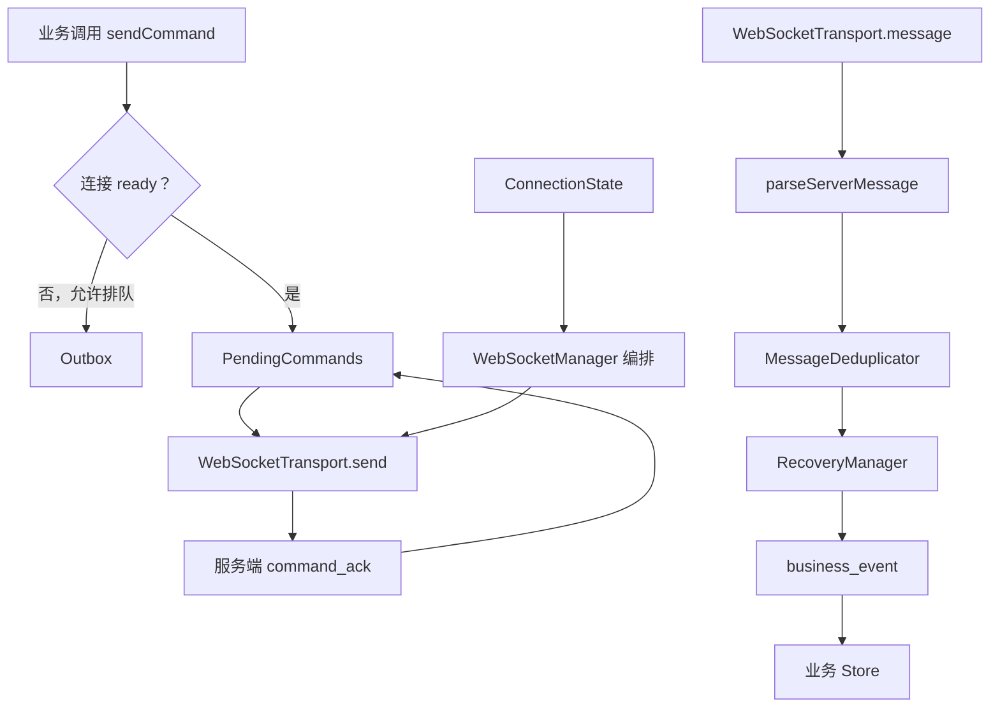

# WebSocketManager 逐行说明

生产代码：

```text
frontend/src/realtime/WebSocketManager.ts
```

这份文档用于学习和面试复盘。生产文件不建议每一行都加注释，否则会降低维护效率。

## 1. 导入依赖

```ts
// 保存连接状态，例如 ready、recovering、kicked 和重连次数。
import {ConnectionState} from './connection/ConnectionState'

// BusinessEvent：服务端下发的业务事件。
// ConnectionMetrics：暴露给 UI 和监控的连接指标。
// KickedMessage：账号互踢消息。
// RealtimeLog：通信层日志结构。
// SnapshotMessage：服务端权威状态快照。
// parseServerMessage：把未知 WebSocket 数据解析并校验成合法协议消息。
import {
  type BusinessEvent,
  type ConnectionMetrics,
  type KickedMessage,
  type RealtimeLog,
  type SnapshotMessage,
  parseServerMessage
} from './protocol'

// 根据 msgId 判断服务端消息是否被重复投递。
import {MessageDeduplicator} from './reliability/MessageDeduplicator'

// 保存连接不可用期间允许延迟发送的业务命令。
import {Outbox} from './reliability/Outbox'

// 保存已经发送，但还没有收到 command_ack 的命令。
import {PendingCommands} from './reliability/PendingCommands'

// 管理 lastSeq、恢复缓冲以及快照和增量消息的合并。
import {RecoveryManager} from './recovery/RecoveryManager'

// 对浏览器原生 WebSocket 进行最小封装。
import {WebSocketTransport} from './transport/WebSocketTransport'

// 提供具有 TypeScript 类型约束的 on、off、emit。
import {TypedEventBus} from './TypedEventBus'

// CommandOptions：命令是否允许排队、重试、TTL 和合并策略。
// CommandResult：sendCommand 最终返回值。
// PendingCommand：正在等待 command_ack 的命令结构。
// WebSocketManagerOptions：创建管理器时的配置。
import type {
  CommandOptions,
  CommandResult,
  PendingCommand,
  WebSocketManagerOptions
} from './types'
```

## 2. 对外事件类型

```ts
// TSnapshot 让不同业务可以定义自己的快照结构。
interface ManagerEvents<TSnapshot> {
  // 连接状态发生变化，例如 connecting -> recovering -> ready。
  state: ConnectionMetrics

  // 数量或延迟等指标变化，但连接状态不一定变化。
  metrics: ConnectionMetrics

  // 统一输出通信层日志。
  log: RealtimeLog

  // 服务端权威快照，由业务 Store 负责应用。
  snapshot: SnapshotMessage<TSnapshot>

  // 已完成 ACK、去重和顺序校验的业务事件。
  business_event: BusinessEvent

  // 同账号登录冲突等互踢事件。
  kicked: KickedMessage

  // 快照与恢复消息合并结束，实时通道正式 ready。
  recovery_complete: {
    snapshotVersion: number
    discardedEvents: number
  }
}

// 业务可以继续从 WebSocketManager 文件导入这些公共类型。
export type {
  CommandOptions,
  CommandResult,
  WebSocketManagerOptions
} from './types'
```

## 3. 类定义和成员

```ts
// TSnapshot 默认为 unknown，接入业务时一般传入 ClassroomSnapshot。
export class WebSocketManager<TSnapshot = unknown>
  // 继承类型化事件总线，让事件名和回调参数具有类型提示。
  extends TypedEventBus<ManagerEvents<TSnapshot>> {

  // Required 把有默认值的配置变为必填。
  // tokenProvider 和 createSocket 保留原始函数类型。
  private readonly options:
    Required<Omit<WebSocketManagerOptions, 'tokenProvider' | 'createSocket'>>
    & Pick<WebSocketManagerOptions, 'tokenProvider' | 'createSocket'>

  // 保存连接状态，不直接操作 socket。
  private readonly connection = new ConnectionState()

  // 真正执行 WebSocket 建连、发送和关闭。
  private readonly transport: WebSocketTransport

  // 保存最近处理过的 msgId。
  private readonly deduplicator: MessageDeduplicator

  // 保存已经发送、正在等待 command_ack 的命令。
  private readonly pending: PendingCommands

  // 保存连接不可用时允许排队的命令。
  private readonly outbox: Outbox

  // 保存 lastSeq 和恢复期间收到的事件。
  private readonly recovery: RecoveryManager

  // 自动重连的定时器，同一时刻最多只能存在一个。
  private reconnectTimer: ReturnType<typeof setTimeout> | null = null

  // 周期性发送应用层 ping。
  private heartbeatTimer: ReturnType<typeof setInterval> | null = null

  // 发送 ping 后等待 pong 的超时定时器。
  private heartbeatDeadlineTimer: ReturnType<typeof setTimeout> | null = null
}
```

## 4. 构造函数

```ts
constructor(options: WebSocketManagerOptions) {
  // 初始化父类 TypedEventBus。
  super()

  // 合并默认配置和业务传入配置。
  this.options = {
    // 默认使用主频道。
    channel: 'main',

    // 第一次重连的基础等待时间。
    baseReconnectDelay: 800,

    // 指数退避最长不超过 15 秒。
    maxReconnectDelay: 15_000,

    // 默认无限重连，生产中建议业务设置合理上限。
    maxReconnectAttempts: Number.POSITIVE_INFINITY,

    // 业务命令等待 command_ack 的最长时间。
    commandTimeout: 5_000,

    // 每 5 秒发送一次应用层 ping。
    heartbeatInterval: 5_000,

    // ping 发出后 10 秒没有 pong，认为是假连接。
    heartbeatTimeout: 10_000,

    // Outbox 最多保存 100 条命令。
    outboxLimit: 100,

    // msgId 去重记录保留 5 分钟。
    processedMessageTtl: 5 * 60_000,

    // 业务传入配置覆盖默认值。
    ...options
  }

  // 创建原生 WebSocket 传输适配器。
  this.transport = new WebSocketTransport(this.options.createSocket)

  // 创建消息去重器。
  this.deduplicator = new MessageDeduplicator(
    this.options.processedMessageTtl
  )

  // 创建离线发件箱。
  this.outbox = new Outbox(this.options.outboxLimit)

  // 不同课堂和频道使用不同 lastSeq 存储 key，避免互相污染。
  this.recovery = new RecoveryManager(
    `websocket:${this.options.liveId}:${this.options.channel}:lastSeq`
  )

  // 创建 Pending 管理器。
  this.pending = new PendingCommands(
    // command_ack 超时时间。
    this.options.commandTimeout,

    // PendingCommands 不依赖 WebSocket，只通过注入函数发送。
    command => this.sendRaw(command),

    // Pending 数量变化后通知 UI 和监控。
    () => this.emitMetrics()
  )

  // 浏览器恢复网络时尝试重新连接。
  window.addEventListener('online', this.handleOnline)

  // 浏览器离线时停止重连并关闭连接。
  window.addEventListener('offline', this.handleOffline)

  // 页面从后台回到前台时立即发送心跳。
  document.addEventListener(
    'visibilitychange',
    this.handleVisibilityChange
  )
}
```

## 5. connect：开始连接

```ts
async connect() {
  // 已经连接、正在连接、已销毁或被踢时，不重复发起连接。
  if (!this.connection.canConnect()) {
    // 被踢必须重新登录并创建新实例，不能直接重连。
    if (this.connection.kicked) {
      this.emitLog(
        'warn',
        '当前连接已被踢，需要重新登录并创建新实例'
      )
    }
    return
  }

  // 浏览器明确离线时不创建 WebSocket。
  if (!navigator.onLine) {
    this.setStatus('offline')
    return
  }

  // 开始新一代连接并获得 epoch。
  // epoch 用于让旧连接的异步回调失效。
  const epoch = this.connection.beginConnect()

  // 把 connecting 或 reconnecting 状态通知业务。
  this.emitState()

  try {
    // 每次连接前重新获取 Token，业务可以在这里刷新过期 Token。
    const token = await this.options.tokenProvider()

    // Token 获取期间可能已经主动关闭或开始了新连接。
    if (!this.connection.isCurrent(epoch)) return

    // 构造 WebSocket URL。
    const url = new URL(this.options.url)

    // Demo 把 Token 放查询参数，真实项目也可使用临时 ticket。
    url.searchParams.set('token', token)

    // 传输层负责注册原生 WebSocket 回调。
    this.transport.connect(url.toString(), {
      // socket open 后开始课堂数据恢复。
      open: () => this.handleOpen(epoch),

      // 收到原始消息后进入协议解析。
      message: raw => this.handleMessage(epoch, raw),

      // 连接错误先标记 failed，最终重连通常由 close 驱动。
      error: () => {
        if (this.connection.isCurrent(epoch)) {
          this.setStatus('failed')
        }
      },

      // 连接关闭后判断是否需要自动重连。
      close: event => this.handleClose(epoch, event)
    })
  } catch (error) {
    // Token 获取、URL 或建连过程失败。
    this.emitLog(
      'error',
      `获取 Token 或创建连接失败：${this.errorMessage(error)}`
    )

    // 更新连接状态。
    this.setStatus('failed')

    // 按退避策略安排下一次连接。
    this.scheduleReconnect()
  }
}
```

## 6. 主动断开和永久销毁

```ts
disconnect() {
  // 标记为用户主动关闭，close 回调不能自动重连。
  this.connection.markManualClose()

  // 清除尚未执行的重连任务。
  this.clearReconnectTimer()

  // 停止心跳和 pong deadline。
  this.stopHeartbeat()

  // 主动断开时 Pending 命令直接失败，不转入 Outbox。
  this.drainPending(
    new Error('WebSocket 已主动断开'),
    false
  )

  // 正常关闭底层 WebSocket。
  this.transport.close(1000, 'manual close')

  // 通知业务状态已经变成 closed。
  this.emitState()
}

destroy() {
  // 标记整个实例永久不可使用，并使旧 epoch 失效。
  this.connection.markDestroyed()

  // 清理重连定时器。
  this.clearReconnectTimer()

  // 清理心跳定时器。
  this.stopHeartbeat()

  // 结束所有仍在等待的命令 Promise。
  this.drainPending(
    new Error('WebSocketManager 已销毁'),
    false
  )

  // 关闭底层连接。
  this.transport.close(1000, 'destroy')

  // 移除浏览器网络事件。
  window.removeEventListener('online', this.handleOnline)
  window.removeEventListener('offline', this.handleOffline)

  // 移除页面可见性事件。
  document.removeEventListener(
    'visibilitychange',
    this.handleVisibilityChange
  )

  // 清空业务通过 on() 注册的所有监听器。
  this.clearListeners()
}
```

## 7. sendCommand：发送业务命令

```ts
sendCommand<TPayload>(
  // 命令类型，例如 courseware.setPage。
  type: string,

  // 命令业务数据。
  payload: TPayload,

  // 离线排队、重试、TTL 和合并策略。
  options: CommandOptions = {}
): Promise<CommandResult> {
  // 组装客户端业务命令。
  const command = {
    // 协议消息类型。
    kind: 'command' as const,

    // 目标消息频道。
    channel: this.options.channel,

    // 防止旧课堂窗口向新课堂发送命令。
    liveId: this.options.liveId,

    // 每次业务操作的唯一 ID。
    // 重连重试时必须复用，服务端才能做幂等。
    clientMsgId: crypto.randomUUID(),

    // 具体业务命令。
    type,

    // 业务参数。
    payload,

    // 客户端发起时间，用于日志和耗时分析。
    clientTime: Date.now()
  }

  // 只有恢复完成后的 ready 状态才允许立即发送业务命令。
  if (this.connection.status !== 'ready') {
    // 业务没有允许离线排队，直接返回失败。
    if (!options.queueWhenOffline) {
      return Promise.reject(
        new Error(`实时通道尚未就绪：${this.connection.status}`)
      )
    }

    // 允许排队时进入 Outbox。
    this.enqueueOutbox(command, options)

    // queued 表示暂存成功，不代表服务端已经处理。
    return Promise.resolve({queued: true})
  }

  // 连接 ready 时直接发送，并等待 command_ack。
  return this.pending.dispatch(command, options)
}
```

## 8. getMetrics：统一连接指标

```ts
getMetrics(): ConnectionMetrics {
  return {
    // 当前连接生命周期状态。
    status: this.connection.status,

    // 服务端分配的连接 ID。
    clientId: this.connection.clientId,

    // 当前连续重连次数。
    reconnectAttempts: this.connection.reconnectAttempts,

    // 已发送但尚未收到 command_ack 的命令数。
    pendingCommands: this.pending.size,

    // 离线发件箱积压数量。
    outboxSize: this.outbox.size,

    // 恢复期间暂存的服务端事件数量。
    bufferedEvents: this.recovery.bufferedCount,

    // 去重缓存中的 msgId 数量。
    processedMessages: this.deduplicator.size,

    // 客户端最后连续处理完成的服务端消息序号。
    lastSeq: this.recovery.lastSeq,

    // 应用层 ping/pong 往返时间。
    latency: this.connection.latency
  }
}
```

## 9. 连接打开和消息分发

```ts
private handleOpen(epoch: number) {
  // 忽略旧连接迟到的 open 回调。
  if (!this.connection.isCurrent(epoch)) return

  // WebSocket 已打开，但课堂数据还没恢复，所以不是 ready。
  this.setStatus('recovering')

  // 开始应用层心跳。
  this.startHeartbeat()

  // 携带 lastSeq 请求补发消息和服务端快照。
  this.requestRecovery()
}

private handleMessage(epoch: number, raw: unknown) {
  // 忽略旧连接或已销毁实例的消息。
  if (!this.connection.isCurrent(epoch)) return

  // 对 JSON 和必要字段进行运行时校验。
  const message = parseServerMessage(raw)

  // 非法或未知消息不进入业务层。
  if (!message) {
    this.emitLog('error', '收到无法识别的服务端消息')
    return
  }

  // 根据协议 kind 分发。
  switch (message.kind) {
    case 'welcome':
      // 保存服务端分配的连接 ID。
      this.connection.clientId = message.clientId
      this.emitMetrics()
      break

    case 'pong':
      // 计算应用层 RTT。
      this.connection.latency = Date.now() - message.requestTime
      // 已收到 pong，取消本轮心跳超时。
      this.clearHeartbeatDeadline()
      this.emitMetrics()
      break

    case 'snapshot':
      // 服务端权威快照到达，完成恢复合并。
      this.completeRecovery(message as SnapshotMessage<TSnapshot>)
      break

    case 'event':
      // 处理服务端业务事件。
      this.receiveEvent(message)
      break

    case 'command_ack':
      // 根据 clientMsgId 结束对应命令 Promise。
      this.pending.resolve(message)
      break

    case 'delivery_failed':
      // 服务端多次投递仍未收到客户端 ACK。
      this.emitLog('error', `服务端消息投递失败：${message.type}`, {
        msgId: message.msgId,
        attempts: message.attempts
      })
      break

    case 'kicked':
      // 被踢后禁止普通自动重连。
      this.connection.kicked = true
      this.setStatus('kicked')
      this.emit('kicked', message)
      break

    case 'error':
      // 输出服务端协议错误。
      this.emitLog('error', `${message.code}: ${message.message}`)
      break
  }
}
```

## 10. 服务端业务事件：ACK、去重和顺序

```ts
private receiveEvent(message: BusinessEvent) {
  // 无论消息是否重复都回复 ACK，避免服务端继续重投。
  this.sendRaw({
    kind: 'ack',
    liveId: this.options.liveId,
    msgId: message.msgId,
    seq: message.seq,
    clientTime: Date.now()
  })

  // 同一 msgId 已经处理过，不再次交给业务。
  if (this.deduplicator.has(message.msgId)) {
    this.emitLog('warn', `msgId 去重：${message.type}`, {
      msgId: message.msgId,
      deliveryAttempt: message.deliveryAttempt
    })
    return
  }

  // 记录本次 msgId。
  this.deduplicator.add(message.msgId)

  // 恢复期间不能立即写 Store，否则可能被随后到达的快照覆盖。
  if (this.connection.status === 'recovering') {
    this.recovery.bufferEvent(message)
    this.emitMetrics()
    return
  }

  // 正常实时阶段按 seq 判断顺序。
  this.applyOrderedEvent(message)
}

private applyOrderedEvent(message: BusinessEvent) {
  // 判断消息是旧消息、存在缺口，还是下一条连续消息。
  const order = this.recovery.classify(message)

  // 旧消息不重复应用。
  if (order === 'old') {
    this.emitLog(
      'warn',
      `seq 防旧：收到 ${message.seq}，本地为 ${this.recovery.lastSeq}`
    )
    return
  }

  // seq 不连续说明中间可能丢消息。
  if (order === 'gap') {
    this.emitLog(
      'warn',
      `检测到消息缺口：期望 ${this.recovery.lastSeq + 1}，实际 ${message.seq}`
    )

    // 先缓存较新的消息。
    this.recovery.bufferEvent(message)

    // 暂停正常实时消费，重新进入恢复阶段。
    this.setStatus('recovering')

    // 从当前 lastSeq 请求缺失消息和快照。
    this.requestRecovery()
    return
  }

  // 消息连续，推进本地消费位置。
  this.recovery.commit(message.seq)

  // 把经过通信层校验的事件交给业务 Store。
  this.emit('business_event', message)

  // 更新页面和监控指标。
  this.emitMetrics()
}
```

## 11. 快照和恢复缓冲合并

```ts
private completeRecovery(snapshot: SnapshotMessage<TSnapshot>) {
  // 服务端快照对应的业务版本。
  const snapshotVersion = snapshot.payload.version

  // 先通知业务 Store 应用服务端权威快照。
  this.emit('snapshot', snapshot)

  // 将恢复缓冲按 seq 排序。
  // 已包含在快照中的事件会被丢弃，快照之后的新事件放入 toApply。
  const result = this.recovery.complete(snapshotVersion)

  // 继续按顺序应用快照之后的事件。
  for (const event of result.toApply) {
    this.applyOrderedEvent(event)
  }

  // 恢复成功后清零连续重连次数。
  this.connection.reconnectAttempts = 0

  // 连接和业务数据都恢复完成，进入 ready。
  this.setStatus('ready')

  // 通知页面恢复完成。
  this.emit('recovery_complete', {
    snapshotVersion,
    discardedEvents: result.discardedEvents
  })

  // ready 后再发送离线积压命令。
  this.flushOutbox()
}

private requestRecovery() {
  // 告诉服务端当前课堂、频道以及客户端最后处理到的 seq。
  this.sendRaw({
    kind: 'subscribe',
    channel: this.options.channel,
    liveId: this.options.liveId,
    lastSeq: this.recovery.lastSeq
  })
}
```

## 12. Outbox 和 Pending 转换

```ts
private enqueueOutbox(
  // 复用 PendingCommands.dispatch 的第一个参数类型。
  command: Parameters<PendingCommands['dispatch']>[0],
  options: CommandOptions,
  pending?: PendingCommand
) {
  // Outbox 负责 TTL、容量和 dedupeKey 合并。
  const {dropped, replaced} =
    this.outbox.enqueue(command, options, pending)

  // 容量超限后，被丢弃命令的原 Promise 必须结束。
  dropped?.pending?.reject(
    new Error(`Outbox 超出容量：${dropped.command.type}`)
  )

  // 被最新状态命令替代时，结束旧命令 Promise。
  replaced?.pending?.reject(
    new Error(`Outbox 命令被更新操作替代：${replaced.command.type}`)
  )

  // 输出可观测日志。
  this.emitLog('warn', `命令进入 Outbox：${command.type}`)

  // 更新 Outbox 数量。
  this.emitMetrics()
}

private flushOutbox() {
  // 记录恢复完成时的当前时间。
  const now = Date.now()

  // 一次取出并清空 Outbox。
  const queued = this.outbox.takeAll()

  // 页面上的 Outbox 数量立即变为 0。
  this.emitMetrics()

  // 逐条处理积压命令。
  for (const item of queued) {
    // 已超过 TTL 的命令不再发送。
    if (item.expiresAt <= now) {
      item.pending?.reject(
        new Error(`Outbox 命令已过期：${item.command.type}`)
      )
      this.emitLog(
        'warn',
        `丢弃过期 Outbox 命令：${item.command.type}`
      )
      continue
    }

    // 重新进入 PendingCommands，发送并等待 command_ack。
    this.pending
      .dispatch(item.command, item.options, item.pending)
      .then(() => {
        this.emitLog(
          'info',
          `Outbox 命令发送成功：${item.command.type}`
        )
      })
      .catch(error => {
        this.emitLog('error', this.errorMessage(error))
      })
  }
}

private drainPending(error: Error, allowRetry: boolean) {
  // 清空所有正在等待 ACK 的命令。
  const retryable = this.pending.drain(
    error,
    // 只有连接异常且业务配置 retryOnReconnect 才允许重试。
    pending =>
      allowRetry
      && Boolean(pending.options.retryOnReconnect)
  )

  // 可重试命令保持原 clientMsgId 和原 Promise，转入 Outbox。
  for (const pending of retryable) {
    this.enqueueOutbox(
      pending.command,
      pending.options,
      pending
    )
  }
}
```

## 13. close 和自动重连

```ts
private handleClose(epoch: number, event: CloseEvent) {
  // 忽略旧连接迟到的 close。
  if (!this.connection.isCurrent(epoch)) return

  // 连接关闭后停止心跳。
  this.stopHeartbeat()

  // 处理仍在等待 ACK 的命令。
  this.drainPending(
    new Error(`连接已断开：${event.code}`),
    true
  )

  // 被踢后不能自动重连。
  if (this.connection.kicked || event.code === 4003) {
    this.setStatus('kicked')
    return
  }

  // 主动关闭、销毁或标准正常关闭不重连。
  if (
    this.connection.destroyed
    || this.connection.manuallyClosed
    || event.code === 1000
  ) {
    this.setStatus('closed')
    return
  }

  // 浏览器无网络时等待 online 事件。
  if (!navigator.onLine) {
    this.setStatus('offline')
    return
  }

  // 其他关闭属于异常断开。
  this.setStatus('failed')

  // 安排自动重连。
  this.scheduleReconnect()
}

private scheduleReconnect() {
  // 不满足重连条件时直接退出。
  if (
    this.connection.destroyed
    || this.connection.kicked
    || this.reconnectTimer
    || !navigator.onLine
  ) {
    return
  }

  // 达到业务配置的最大重连次数后停止。
  if (
    this.connection.reconnectAttempts
    >= this.options.maxReconnectAttempts
  ) {
    this.emitLog('error', '已达到最大重连次数')
    return
  }

  // 增加本轮连续重连次数。
  this.connection.reconnectAttempts += 1

  // 指数退避：800、1600、3200……并受最大值限制。
  const exponential = Math.min(
    this.options.baseReconnectDelay
      * 2 ** (this.connection.reconnectAttempts - 1),
    this.options.maxReconnectDelay
  )

  // 添加随机抖动，避免大量客户端同时重连。
  const delay =
    exponential
    + Math.round(
      Math.random() * Math.min(1000, exponential * 0.3)
    )

  // 输出重连日志。
  this.emitLog(
    'warn',
    `第 ${this.connection.reconnectAttempts} 次重连将在 ${delay}ms 后执行`
  )

  // 更新重连次数指标。
  this.emitMetrics()

  // 保证同一时刻只有一个重连定时器。
  this.reconnectTimer = setTimeout(() => {
    this.reconnectTimer = null
    void this.connect()
  }, delay)
}
```

## 14. 心跳

```ts
private startHeartbeat() {
  // 防止创建多个心跳定时器。
  this.stopHeartbeat()

  // 周期发送 ping。
  this.heartbeatTimer = setInterval(
    () => this.sendHeartbeat(),
    this.options.heartbeatInterval
  )

  // 连接建立后立即发送一次，不等待第一个周期。
  this.sendHeartbeat()
}

private sendHeartbeat() {
  // 上一轮 ping 还没有收到 pong 时不重复创建 deadline。
  if (this.heartbeatDeadlineTimer) return

  // 底层连接不可用时不启动超时判断。
  if (!this.sendRaw({
    kind: 'ping',
    clientTime: Date.now()
  })) {
    return
  }

  // 在 heartbeatTimeout 内没有 pong，就关闭假连接。
  this.heartbeatDeadlineTimer = setTimeout(() => {
    this.emitLog('error', '心跳响应超时，主动关闭假连接')
    this.transport.close(4000, 'heartbeat timeout')
  }, this.options.heartbeatTimeout)
}

private stopHeartbeat() {
  // 清理周期定时器。
  if (this.heartbeatTimer) {
    clearInterval(this.heartbeatTimer)
  }
  this.heartbeatTimer = null

  // 清理当前 pong 等待定时器。
  this.clearHeartbeatDeadline()
}

private clearHeartbeatDeadline() {
  // pong 已到达或连接已关闭，取消本轮超时。
  if (this.heartbeatDeadlineTimer) {
    clearTimeout(this.heartbeatDeadlineTimer)
  }
  this.heartbeatDeadlineTimer = null
}
```

## 15. 通用辅助方法

```ts
private sendRaw(message: unknown) {
  try {
    // 委托传输层检查 readyState、序列化并发送。
    return this.transport.send(message)
  } catch (error) {
    // 序列化或原生 send 抛错时统一记录。
    this.emitLog(
      'error',
      `WebSocket 发送异常：${this.errorMessage(error)}`
    )
    return false
  }
}

private setStatus(status: ConnectionMetrics['status']) {
  // 修改连接状态。
  this.connection.status = status

  // 状态变化使用 state 事件通知。
  this.emitState()
}

private emitState() {
  // 输出一份完整指标，而不是只输出 status 字符串。
  this.emit('state', this.getMetrics())
}

private emitMetrics() {
  // 数量和延迟变化使用 metrics 事件通知。
  this.emit('metrics', this.getMetrics())
}

private emitLog(
  level: RealtimeLog['level'],
  text: string,
  context?: Record<string, unknown>
) {
  // 通信层不直接依赖具体日志 SDK。
  this.emit('log', {level, text, context})
}

private clearReconnectTimer() {
  // 主动断开或销毁时取消尚未执行的重连。
  if (this.reconnectTimer) {
    clearTimeout(this.reconnectTimer)
  }
  this.reconnectTimer = null
}

private errorMessage(error: unknown) {
  // 统一把 unknown 错误转换为可记录字符串。
  return error instanceof Error
    ? error.message
    : String(error)
}
```

## 16. 浏览器生命周期

```ts
private readonly handleOnline = () => {
  // 记录网络恢复。
  this.emitLog('info', '浏览器网络恢复')

  // 只有异常离线场景才自动连接。
  // 手动关闭、销毁和被踢都不应该自动连接。
  if (
    !this.connection.destroyed
    && !this.connection.manuallyClosed
    && !this.connection.kicked
    && this.connection.status !== 'ready'
  ) {
    void this.connect()
  }
}

private readonly handleOffline = () => {
  // 记录浏览器离线。
  this.emitLog('warn', '浏览器网络离线')

  // 离线期间不继续执行重连定时器。
  this.clearReconnectTimer()

  // 更新状态。
  this.setStatus('offline')

  // 主动关闭底层连接，触发统一清理流程。
  this.transport.close(4000, 'browser offline')
}

private readonly handleVisibilityChange = () => {
  // 浏览器后台定时器可能被降频。
  // 回到前台后立即发送一次心跳，检查连接是否仍然可用。
  if (
    document.visibilityState === 'visible'
    && this.connection.status === 'ready'
  ) {
    this.sendHeartbeat()
  }
}
```

## 17. 总体调用关系



## 18. 面试总结

可以这样描述这份代码：

> `WebSocketManager` 是门面和流程编排层。底层 `WebSocketTransport` 管原生连接，`ConnectionState` 管生命周期，`PendingCommands` 管客户端命令确认，`Outbox` 管离线命令，`MessageDeduplicator` 管下行消息去重，`RecoveryManager` 管 lastSeq、消息缺口和快照恢复。业务只需要调用 connect、sendCommand、on 和 destroy，不直接感知底层可靠性细节。
